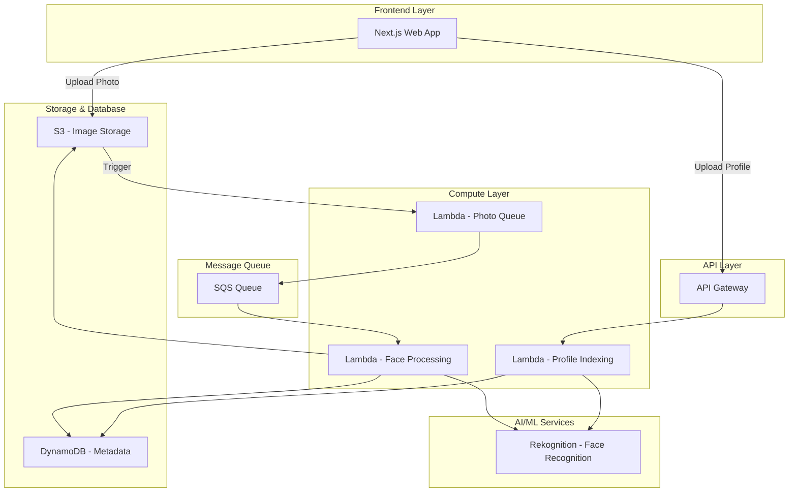

# FaceShare - Serverless Face Recognition Platform

> **AWS Cloud Practitioner Level Project** | **Serverless Architecture** | **Cost-Optimized Design**

A production-ready, serverless face recognition application built on AWS that automatically tags event photos by matching faces against user profiles. Built as a comprehensive learning project to master AWS services and serverless architecture patterns.


## 🎯 Project Overview

FaceShare enables users to:
- **Upload 3-5 profile photos** for facial recognition enrollment
- **Create events** (weddings, parties, conferences) with unique join codes
- **Bulk upload event photos** that are automatically processed
- **Get tagged in photos** where they appear via AI face matching
- **View and download** their photos through a personal gallery

### Key Features
- ✅ **100% Serverless** - No servers to manage
- ✅ **Auto-scaling** - Handles 1 to 1,000,000 photos
- ✅ **Cost-optimized** - Under $1/month for typical usage
- ✅ **Event-driven** - Real-time photo processing
- ✅ **Secure** - Presigned URLs, IAM roles, encrypted storage

---

## 🏗️ Architecture

### High-Level Design



### AWS Services Used

| Service | Purpose | Why We Chose It |
|---------|---------|-----------------|
| **S3** | Image storage | Infinite scale, lifecycle policies, cheapest storage |
| **DynamoDB** | Metadata database | NoSQL, single-digit ms latency, pay-per-request |
| **Rekognition** | Face recognition | Managed AI, 99%+ accuracy, no model training |
| **Lambda** | Compute | Serverless, auto-scale, pay-per-use |
| **SQS** | Message queue | Decoupling, buffering, reliable delivery |
| **API Gateway** | REST API | Managed, throttling, caching |
| **CloudWatch** | Monitoring | Built-in, alarms, logs |

---

## 📚 Learning Path (7 Weeks)

This project is designed as a progressive learning journey:

| Week | Topic | AWS Services | Skills Gained |
|------|-------|--------------|---------------|
| [Week 1](week1-aws-setup.md) | AWS Setup | IAM, CLI, Billing | Security, access management |
| [Week 2](week2-s3-storage.md) | S3 Storage | S3, Lifecycle | Object storage, presigned URLs |
| [Week 3](week3-dynamodb.md) | DynamoDB | DynamoDB | NoSQL design, single-table |
| [Week 4](week4-rekognition.md) | Face Recognition | Rekognition | AI/ML integration |
| [Week 5](week5-lambda-serverless.md) | Serverless | Lambda, SQS | Event-driven architecture |
| [Week 6](week6-api-gateway.md) | API Layer | API Gateway | REST API design |
| [Week 7](week7-production.md) | Production | CloudFront, CI/CD | Production deployment |

---

## 💰 Cost Analysis

### Monthly Cost Breakdown (Typical Usage: 100 photos/month)

| Service | Usage | Cost |
|---------|-------|------|
| **S3 Storage** | 500MB | $0.01 |
| **S3 API Calls** | 1,000 requests | $0.00 |
| **DynamoDB** | On-demand, low volume | $0.00 |
| **Rekognition** | 100 faces indexed + searched | $0.20 |
| **Lambda** | 1,000 invocations, 512MB | $0.05 |
| **SQS** | 1,000 messages | $0.00 |
| **API Gateway** | 1,000 requests | $0.00 |
| **Data Transfer** | 1GB | $0.09 |
| **CloudWatch** | Logs | $0.05 |
| **TOTAL** | | **~$0.40/month** |

### Cost Comparison: Serverless vs Traditional

| Architecture | Monthly Cost | Management |
|--------------|--------------|------------|
| **EC2 + RDS** (t3.micro) | ~$25-40 | High (patches, scaling) |
| **ECS Fargate** | ~$15-25 | Medium |
| **Serverless (This)** | ~$0.40 | **None** |
| **Savings** | **98%** | **100%** |

---

## 🚀 Quick Start

### Prerequisites
- AWS Account ([Free Tier](https://aws.amazon.com/free/))
- AWS CLI installed
- Python 3.11+
- Node.js 18+ (for frontend)

### Installation

```bash
# Clone repository
git clone https://github.com/johnpaul-raphael/face-share.git
cd face-share

# Install backend dependencies
cd backend
pip install -r requirements.txt

# Configure AWS credentials
aws configure

# Create environment file
cp .env.example .env
# Edit .env with your AWS credentials

# Run tests
python test_config.py
python test_dynamodb.py
python test_rekognition.py
```

### Deployment

```bash
# Deploy infrastructure
cd infrastructure
npm install
serverless deploy --stage dev
```

---

## 📁 Project Structure

```
face-share/
├── backend/                    # FastAPI application
│   ├── app/
│   │   ├── api/               # REST endpoints
│   │   ├── core/              # S3, DynamoDB, Rekognition services
│   │   ├── database/          # SQLAlchemy models
│   │   └── services/          # Business logic
│   ├── test_*.py              # Test scripts
│   └── requirements.txt
├── frontend/                   # Next.js application
│   └── src/
├── infrastructure/             # Serverless Framework
│   ├── serverless.yml
│   └── lambda/                # Lambda functions
└── docs/                      # Documentation (you are here!)
```

---

## 🎓 Skills Demonstrated

### AWS Services (7 Services)
- **IAM** - Security, least-privilege access
- **S3** - Object storage, lifecycle policies, presigned URLs
- **DynamoDB** - NoSQL design, single-table pattern, GSIs
- **Rekognition** - AI/ML integration, face recognition
- **Lambda** - Serverless functions, event triggers
- **SQS** - Message queuing, decoupling
- **API Gateway** - REST API, throttling, caching

### Architecture Patterns
- ✅ **Serverless Architecture** - No server management
- ✅ **Event-Driven Design** - S3 triggers, SQS messages
- ✅ **Microservices** - Decoupled services
- ✅ **Multi-Environment** - Dev, QA, Prod isolation
- ✅ **Infrastructure as Code** - Serverless Framework

### Best Practices
- ✅ **Security** - IAM roles, presigned URLs, encryption
- ✅ **Scalability** - Auto-scaling, no bottlenecks
- ✅ **Cost Optimization** - 98% cost reduction vs EC2
- ✅ **Observability** - CloudWatch logs, metrics
- ✅ **CI/CD Ready** - GitHub Actions compatible

---

## 📝 Documentation Index

### Core Learning
1. [Week 1: AWS Setup](week1-aws-setup.md) - IAM, CLI, billing alerts
2. [Week 2: S3 Storage](week2-s3-storage.md) - Object storage, presigned URLs
3. [Week 3: DynamoDB](week3-dynamodb.md) - NoSQL data modeling
4. [Week 4: Rekognition](week4-rekognition.md) - Face recognition
5. [Week 5: Lambda & Serverless](week5-lambda-serverless.md) - Automation
6. [Week 6: API Gateway](week6-api-gateway.md) - REST APIs
7. [Week 7: Production](week7-production.md) - Deployment & monitoring

### Additional Resources
- [Cost Optimization Guide](cost-optimization.md)
- [Troubleshooting](troubleshooting.md)
- [Architecture Diagrams](architecture-diagrams.md)

---

## 🏆 Achievements

### Cost Optimization
- **98% cost reduction** compared to EC2/RDS architecture
- **Under $1/month** for typical usage (100 photos)
- **Pay-per-use** model - no idle resources

### Performance
- **Single-digit ms latency** for API responses
- **Auto-scaling** from 0 to thousands of requests
- **Parallel processing** with SQS batching

### Security
- **No hardcoded credentials** - Environment variables
- **Presigned URLs** - Secure temporary access
- **IAM least privilege** - Minimal permissions
- **Encrypted storage** - S3 encryption at rest

---

## 🔗 Resources

- [AWS Free Tier](https://aws.amazon.com/free/)
- [AWS Rekognition Documentation](https://docs.aws.amazon.com/rekognition/)
- [Serverless Framework](https://www.serverless.com/)
- [Boto3 Documentation](https://boto3.amazonaws.com/v1/documentation/api/latest/index.html)

---

## 📄 License

MIT License - Feel free to use this for learning and your own projects!

---

## 🤝 Contributing

This is a learning project. If you find issues or improvements, please open an issue or PR!

---

## 📞 Contact

For questions about this project:
- GitHub Issues: [Create an issue](https://github.com/johnpaul-raphael/face-share/issues)
- LinkedIn: [Your LinkedIn Profile]

---

**Built with ❤️ for AWS Cloud Practitioners**

*This project demonstrates production-ready AWS architecture skills perfect for cloud engineering roles.*