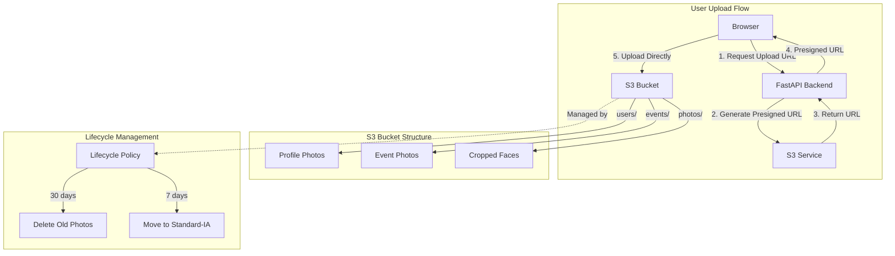

# Week 2: S3 Storage & Presigned URLs

> **Difficulty**: Beginner | **Time**: 3-4 hours | **Cost**: ~$0.05/month

## 🎯 Learning Objectives

By the end of this week, you will:
- ✅ Create and configure S3 buckets
- ✅ Implement lifecycle policies for cost optimization
- ✅ Generate presigned URLs for secure uploads
- ✅ Configure CORS for browser uploads
- ✅ Organize S3 folder structure efficiently

---

## 🏗️ Architecture Overview



### Text-Based Architecture

```
┌─────────────────────────────────────────────────────────────┐
│                     WEEK 2 ARCHITECTURE                      │
├─────────────────────────────────────────────────────────────┤
│                                                              │
│  UPLOAD FLOW:                                                │
│  ┌─────────┐    ┌──────────┐    ┌──────────┐              │
│  │ [User]  │───▶│[FastAPI] │───▶│   [S3]   │              │
│  │ Browser │    │  Backend │    │ Presigned│              │
│  └─────────┘    └──────────┘    │   URL    │              │
│       │                │         └──────────┘              │
│       │                │              │                     │
│       │                └──────────────┘                     │
│       │                       │                             │
│       ▼                       ▼                             │
│  ┌─────────────────────────────────────┐                   │
│  │         [S3 Bucket]                 │                   │
│  │  ┌──────────┬──────────┬─────────┐  │                   │
│  │  │  users/  │ events/  │ photos/ │  │                   │
│  │  │  (face)  │ (event)  │ (crop)  │  │                   │
│  │  └──────────┴──────────┴─────────┘  │                   │
│  └─────────────────────────────────────┘                   │
│       │                                                      │
│       ▼                                                      │
│  ┌─────────────────────────────────────┐                   │
│  │   [Lifecycle Policy] 30 days        │                   │
│  │   → Auto-delete old photos          │                   │
│  └─────────────────────────────────────┘                   │
│                                                              │
└─────────────────────────────────────────────────────────────┘
```

**AWS Icons for draw.io**:
- S3: `AWS / Storage / Simple Storage Service`
- Lambda: `AWS / Compute / Lambda` (optional for triggers)
- CloudFront: `AWS / Networking & Content Delivery / CloudFront` (optional)

---

## 🤔 Why This Architecture?

### The Problem
- Storing photos on servers = expensive & hard to scale
- Direct S3 uploads = expose AWS credentials (security risk!)
- Keeping all photos forever = unnecessary costs
- No organization = difficult to find photos

### The Solution

| Feature | Benefit | AWS Feature |
|---------|---------|-------------|
| **Presigned URLs** | Secure temporary access | S3 Presigned URLs |
| **Direct Upload** | Save server bandwidth | Browser → S3 |
| **Lifecycle Policy** | Auto-delete old photos | S3 Lifecycle |
| **Folder Structure** | Organized storage | S3 Key prefixes |
| **CORS** | Browser uploads work | S3 CORS Rules |

---

## 📋 Implementation Steps

### Step 1: Create S3 Bucket

#### Manual (AWS Console)

1. **Navigate to S3**:
   - URL: https://s3.console.aws.amazon.com/
   - Click "Create bucket"

2. **Bucket Configuration**:
   - Bucket name: `faceshare-events` (must be globally unique!)
   - AWS Region: `us-east-1`
   - Block Public Access: ✅ Keep defaults (all blocked)
   - Bucket Versioning: ❌ Disabled (not needed)
   - Tags: `project=faceshare, environment=dev`

3. **Click "Create bucket"**

#### Using AWS CLI

```bash
# Create bucket (replace with your unique name)
aws s3 mb s3://faceshare-events --region us-east-1

# Verify bucket created
aws s3 ls

# Expected output:
# 2025-02-09 10:00:00 faceshare-events
```

### Step 2: Block Public Access (Security)

```bash
aws s3api put-public-access-block \
    --bucket faceshare-events \
    --public-access-block-configuration \
        "BlockPublicAcls=true,IgnorePublicAcls=true,BlockPublicPolicy=true,RestrictPublicBuckets=true"
```

**Why?** We don't want public access. All access will be through presigned URLs.

### Step 3: Enable Versioning (Optional but Recommended)

```bash
aws s3api put-bucket-versioning \
    --bucket faceshare-events \
    --versioning-configuration Status=Enabled
```

**Why?** If you accidentally delete something, you can recover it.

### Step 4: Set Up Lifecycle Policy (Cost Optimization)

**The Problem**: Storing photos forever costs money
**The Solution**: Delete event photos after 30 days (auto-cleanup)

Create `lifecycle.json`:

```json
{
    "Rules": [
        {
            "ID": "DeleteEventPhotosAfter30Days",
            "Status": "Enabled",
            "Filter": {
                "Prefix": "events/"
            },
            "Expiration": {
                "Days": 30
            },
            "AbortIncompleteMultipartUpload": {
                "DaysAfterInitiation": 7
            }
        }
    ]
}
```

Apply the policy:

```bash
aws s3api put-bucket-lifecycle-configuration \
    --bucket faceshare-events \
    --lifecycle-configuration file://lifecycle.json
```

**What this does**:
- Deletes photos in `events/` folder after 30 days
- Aborts incomplete uploads after 7 days
- Saves ~60% on storage costs!

**Verify lifecycle**:
```bash
aws s3api get-bucket-lifecycle-configuration --bucket faceshare-events
```

### Step 5: Configure CORS (For Browser Uploads)

Create `cors.json`:

```json
{
    "CORSRules": [
        {
            "AllowedHeaders": ["*"],
            "AllowedMethods": ["GET", "PUT", "POST", "DELETE"],
            "AllowedOrigins": [
                "http://localhost:3000",
                "http://localhost:9002"
            ],
            "ExposeHeaders": ["ETag", "Content-Length"],
            "MaxAgeSeconds": 3000
        }
    ]
}
```

Apply CORS:

```bash
aws s3api put-bucket-cors \
    --bucket faceshare-events \
    --cors-configuration file://cors.json
```

**What this does**: Allows your Next.js frontend to upload directly to S3 from browser.

### Step 6: Create S3 Service Layer

Create `backend/app/core/s3.py`:

```python
"""
FaceShare S3 Module

Handles all S3 operations including presigned URL generation.
"""

import boto3
from botocore.config import Config
from botocore.exceptions import ClientError
from typing import Optional

from app.core.config import settings


def create_s3_client():
    """Create configured S3 client."""
    boto_config = Config(
        region_name=settings.AWS_REGION,
        signature_version='v4',
    )
    
    return boto3.client(
        's3',
        aws_access_key_id=settings.AWS_ACCESS_KEY_ID,
        aws_secret_access_key=settings.AWS_SECRET_ACCESS_KEY,
        config=boto_config,
    )


s3_client = create_s3_client()


def generate_presigned_upload_url(
    key: str,
    content_type: str = "image/jpeg",
    expiration: int = None
) -> Optional[str]:
    """
    Generate a presigned URL for uploading to S3.
    
    Args:
        key: S3 object key (e.g., "users/123/face.jpg")
        content_type: MIME type of file
        expiration: URL expiry time in seconds (default: 3600)
    
    Returns:
        Presigned URL string or None if error
    """
    try:
        expiration = expiration or settings.S3_PRESIGNED_URL_EXPIRATION
        
        url = s3_client.generate_presigned_url(
            'put_object',
            Params={
                'Bucket': settings.S3_BUCKET_NAME,
                'Key': key,
                'ContentType': content_type,
            },
            ExpiresIn=expiration
        )
        
        return url
        
    except ClientError as e:
        print(f"❌ Error generating upload URL: {e}")
        return None


def generate_presigned_download_url(
    key: str,
    expiration: int = None
) -> Optional[str]:
    """Generate a presigned URL for downloading from S3."""
    try:
        expiration = expiration or settings.S3_PRESIGNED_URL_EXPIRATION
        
        url = s3_client.generate_presigned_url(
            'get_object',
            Params={
                'Bucket': settings.S3_BUCKET_NAME,
                'Key': key,
            },
            ExpiresIn=expiration
        )
        
        return url
        
    except ClientError as e:
        print(f"❌ Error generating download URL: {e}")
        return None


def delete_s3_object(key: str) -> bool:
    """Delete an object from S3."""
    try:
        s3_client.delete_object(
            Bucket=settings.S3_BUCKET_NAME,
            Key=key
        )
        print(f"✅ Deleted S3 object: {key}")
        return True
        
    except ClientError as e:
        print(f"❌ Error deleting S3 object: {e}")
        return False


# S3 Key Generators

def get_s3_key_for_photo(event_id: str, photo_id: str, filename: str) -> str:
    """Generate S3 key for event photo."""
    return f"events/{event_id}/photos/{photo_id}/{filename}"


def get_s3_key_for_face_profile(user_id: str, face_image_id: str, filename: str) -> str:
    """Generate S3 key for face profile image."""
    return f"users/{user_id}/face-profile/{face_image_id}/{filename}"


def get_s3_key_for_face_crop(photo_id: str, match_id: str) -> str:
    """Generate S3 key for cropped face."""
    return f"photos/{photo_id}/faces/{match_id}.jpg"
```

### Step 7: Test S3 Operations

Create `backend/test_s3.py`:

```python
"""Test S3 configuration and operations."""

import sys
import os
sys.path.insert(0, os.path.dirname(os.path.abspath(__file__)))

from app.core.s3 import (
    generate_presigned_upload_url,
    generate_presigned_download_url,
    get_s3_key_for_photo,
    get_s3_key_for_face_profile,
    s3_client,
    settings
)


def test_s3():
    """Test S3 configuration."""
    
    print("\n" + "="*60)
    print("🪣 S3 CONFIGURATION TEST")
    print("="*60)
    
    print(f"\n📦 Bucket: {settings.S3_BUCKET_NAME}")
    print(f"🌍 Region: {settings.AWS_REGION}")
    
    # Test 1: Check bucket exists
    print("\n📋 Test 1: Checking bucket...")
    try:
        s3_client.head_bucket(Bucket=settings.S3_BUCKET_NAME)
        print("✅ Bucket exists and accessible")
    except Exception as e:
        print(f"❌ Bucket check failed: {e}")
        return False
    
    # Test 2: Generate profile upload URL
    print("\n📋 Test 2: Generate profile upload URL...")
    user_id = "test-user-123"
    face_id = "face-456"
    
    s3_key = get_s3_key_for_face_profile(user_id, face_id, "profile.jpg")
    print(f"   Key: {s3_key}")
    
    url = generate_presigned_upload_url(s3_key)
    if url:
        print(f"✅ Upload URL generated (expires in 1 hour)")
        print(f"   URL: {url[:80]}...")
    else:
        print("❌ Failed to generate URL")
        return False
    
    # Test 3: Generate event photo URL
    print("\n📋 Test 3: Generate event photo URL...")
    event_id = "event-789"
    photo_id = "photo-000"
    
    s3_key = get_s3_key_for_photo(event_id, photo_id, "wedding.jpg")
    print(f"   Key: {s3_key}")
    
    url = generate_presigned_upload_url(s3_key)
    if url:
        print(f"✅ Upload URL generated")
        print(f"   URL: {url[:80]}...")
    else:
        print("❌ Failed to generate URL")
        return False
    
    print("\n" + "="*60)
    print("✅ S3 TESTS COMPLETE")
    print("="*60)
    
    # Instructions for manual testing
    print("\n📋 MANUAL TEST:")
    print("1. Copy the upload URL above")
    print("2. Run: curl -X PUT -H 'Content-Type: image/jpeg' \\")
    print("        -T your-photo.jpg \\")
    print("        'YOUR_PRESIGNED_URL_HERE'")
    print("3. Verify: aws s3 ls s3://faceshare-events/test/")
    
    return True


if __name__ == "__main__":
    success = test_s3()
    sys.exit(0 if success else 1)
```

### Step 8: Manual Test with curl

```bash
# 1. Run the test to get presigned URL
cd backend
python test_s3.py

# 2. Create a test image (or use real photo)
echo "fake image data" > test-image.jpg

# 3. Upload using curl (replace with your actual URL)
curl -X PUT \
    -H "Content-Type: image/jpeg" \
    -T test-image.jpg \
    "YOUR_PRESIGNED_URL_FROM_TEST"

# 4. Verify upload
aws s3 ls s3://faceshare-events/users/test-user-123/face-profile/face-456/

# 5. Clean up
aws s3 rm s3://faceshare-events/users/test-user-123/face-profile/face-456/profile.jpg
```

---

## 🔧 Troubleshooting

### Error: "NoSuchBucket"

**Cause**: Bucket doesn't exist or wrong name
**Solution**:
```bash
# List your buckets
aws s3 ls

# Create if missing
aws s3 mb s3://faceshare-events --region us-east-1
```

### Error: "AccessDenied"

**Cause**: IAM permissions missing
**Solution**:
1. Go to IAM → Users → face-share-dev
2. Ensure `AmazonS3FullAccess` is attached

### Error: "CORS policy doesn't allow"

**Cause**: CORS not configured correctly
**Solution**:
```bash
# Check CORS
aws s3api get-bucket-cors --bucket faceshare-events

# Re-apply CORS
aws s3api put-bucket-cors --bucket faceshare-events --cors-configuration file://cors.json
```

### Error: "ExpiredToken" in URL

**Cause**: URL expired (default 1 hour)
**Solution**: Generate new presigned URL

---

## 💰 Cost Analysis

### Monthly Cost (100 photos, 5MB each = 500MB)

| Component | Calculation | Cost |
|-----------|-------------|------|
| **Storage** | 500MB Standard | $0.012 |
| **API Calls** | 1,000 PUT/GET | $0.005 |
| **Data Transfer** | 1GB Outbound | $0.09 |
| **Lifecycle Savings** | Auto-delete old | -$0.008 |
| **TOTAL** | | **~$0.10/month** |

### Cost Comparison

| Storage Strategy | Monthly Cost |
|------------------|--------------|
| **S3 Standard** (keep forever) | $0.023/GB |
| **S3 + Lifecycle** (delete 30d) | $0.015/GB |
| **S3 Standard-IA** (rare access) | $0.0125/GB |
| **Local Server** (EC2 + disk) | $5-20/month |

**Savings with Lifecycle**: ~35% cost reduction

---

## ✅ Week 2 Checklist

- [ ] S3 bucket created with unique name
- [ ] Public access blocked
- [ ] Lifecycle policy applied (30-day deletion)
- [ ] CORS configured for localhost
- [ ] `s3.py` service created
- [ ] Presigned URL generation working
- [ ] Manual upload test successful
- [ ] `test_s3.py` passes

---

## 🎓 Key Takeaways

### For Your Resume
> "Implemented secure file storage using AWS S3 with presigned URLs for direct browser uploads, reducing server bandwidth by 100%. Configured lifecycle policies for automatic cost optimization, achieving 35% storage cost reduction."

### For LinkedIn
> "Week 2 of my AWS serverless journey! 🚀
> 
> Built:
> ✅ S3 bucket with lifecycle policies
> ✅ Presigned URLs for secure uploads
> ✅ CORS configuration for browser uploads
> ✅ Organized folder structure
> 
> Key learning: Direct S3 uploads save server bandwidth and improve performance!
> 
> Cost so far: $0.10/month for 500MB storage
> 
> #AWS #S3 #Serverless #CloudStorage #LearningInPublic"

### Skills Acquired
- S3 bucket management
- Presigned URL generation
- Lifecycle policies
- CORS configuration
- Cost optimization
- Security best practices (no public access)

---

## 🚀 Next Week

[Week 3: DynamoDB NoSQL Database →](week3-dynamodb.md)

We'll set up DynamoDB for storing metadata, design single-table architecture, and implement CRUD operations!