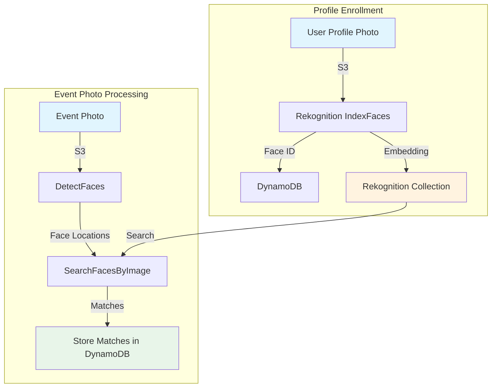

# Week 4: AWS Rekognition Face Recognition

> **Difficulty**: Intermediate | **Time**: 4-5 hours | **Cost**: ~$0.20/month (100 faces)

## 🎯 Learning Objectives

By the end of this week, you will:
- ✅ Create Rekognition face collections
- ✅ Index faces from profile photos
- ✅ Detect faces in event photos
- ✅ Search and match faces
- ✅ Integrate with DynamoDB
- ✅ Build end-to-end face matching pipeline

---

## 🏗️ Architecture Overview



### Text-Based Architecture

```
┌─────────────────────────────────────────────────────────────────┐
│              AWS REKOGNITION ARCHITECTURE                        │
├─────────────────────────────────────────────────────────────────┤
│                                                                  │
│  PROFILE ENROLLMENT (One-time per user):                        │
│  ┌─────────────┐    ┌──────────────┐    ┌──────────────┐      │
│  │   User      │───▶│  S3 Bucket   │───▶│ Rekognition  │      │
│  │   Photo     │    │  (Storage)   │    │ IndexFaces   │      │
│  └─────────────┘    └──────────────┘    └──────┬───────┘      │
│                                                 │               │
│                                                 ▼               │
│                                        ┌──────────────┐        │
│                                        │  Collection  │        │
│                                        │  (Face Emb   │        │
│                                        │   eddings)   │        │
│                                        └──────┬───────┘        │
│                                               │                 │
│                                               ▼                 │
│                                        ┌──────────────┐        │
│                                        │  DynamoDB    │        │
│                                        │  (Face ID    │        │
│                                        │   mapping)   │        │
│                                        └──────────────┘        │
│                                                                  │
│  EVENT PHOTO PROCESSING (Per photo):                            │
│  ┌─────────────┐    ┌──────────────┐    ┌──────────────┐      │
│  │   Event     │───▶│  S3 Bucket   │───▶│ DetectFaces  │      │
│  │   Photo     │    │  (Storage)   │    │ (Find faces) │      │
│  └─────────────┘    └──────────────┘    └──────┬───────┘      │
│                                                 │               │
│                                                 ▼               │
│                                        ┌──────────────┐        │
│                                        │SearchFacesBy │        │
│                                        │   Image      │        │
│                                        │(Match against│        │
│                                        │ collection)  │        │
│                                        └──────┬───────┘        │
│                                               │                 │
│                                               ▼                 │
│                                        ┌──────────────┐        │
│                                        │  DynamoDB    │        │
│                                        │  (Store      │        │
│                                        │   matches)   │        │
│                                        └──────────────┘        │
│                                                                  │
└─────────────────────────────────────────────────────────────────┘
```

**AWS Icons for draw.io**:
- Rekognition: `AWS / Machine Learning / Rekognition`
- S3: `AWS / Storage / Simple Storage Service`
- DynamoDB: `AWS / Database / DynamoDB`

---

## 🤔 Why AWS Rekognition?

### The Problem
Building face recognition from scratch requires:
- Deep learning expertise
- Massive training datasets
- GPU infrastructure
- Ongoing model maintenance

### Why Rekognition Wins

| Feature | Benefit | Cost |
|---------|---------|------|
| **Pre-trained models** | No training needed | $0 setup |
| **99%+ accuracy** | Production-ready | Included |
| **Scales infinitely** | Handle millions of faces | Pay-per-use |
| **No infrastructure** | Fully managed | No servers |
| **Fast** | ~100ms per face | Included |

### Rekognition vs Building Your Own

| Aspect | Rekognition | Self-Built (DeepFace) |
|--------|-------------|----------------------|
| Setup time | 5 minutes | Days/weeks |
| Accuracy | 99%+ | 90-95% |
| Infrastructure | None needed | GPU server |
| Scaling | Automatic | Manual |
| Cost at scale | ~$1/1000 faces | Server costs |
| Maintenance | AWS handles | You handle |

---

## 📋 Implementation Steps

### Step 1: Create Rekognition Collection

A collection is a container for face embeddings (like a database table for faces).

#### Using AWS CLI

```bash
# Create a face collection
aws rekognition create-collection \
    --collection-id faceshare-collection \
    --region us-east-1

# Expected output:
# {
#     "CollectionArn": "arn:aws:rekognition:us-east-1:123456789012:collection/faceshare-collection",
#     "FaceModelVersion": "7.0",
#     "StatusCode": 200
# }

# Verify collection
aws rekognition describe-collection \
    --collection-id faceshare-collection

# List all faces in collection (initially empty)
aws rekognition list-faces \
    --collection-id faceshare-collection
```

**What is a Collection?**
- Container for face embeddings (128-dimensional vectors)
- Each face gets a unique FaceId
- You can store up to 20 million faces per collection
- Supports real-time face matching

#### Using Serverless Framework

Add to `infrastructure/serverless.yml`:

```yaml
resources:
  Resources:
    FaceCollection:
      Type: AWS::Rekognition::Collection
      Properties:
        CollectionId: faceshare-collection-${self:provider.stage}
```

### Step 2: Create Rekognition Service

Create `backend/app/core/rekognition.py`:

```python
"""
AWS Rekognition Service for FaceShare

Handles face detection, indexing, and matching.
"""

import boto3
from botocore.exceptions import ClientError
from typing import List, Dict, Optional
import json

from app.core.config import settings


class RekognitionService:
    """
    Service for AWS Rekognition face recognition operations.
    
    Provides:
    - Index faces (store in collection)
    - Search faces (find matches)
    - Detect faces (find faces in images)
    """
    
    def __init__(self, collection_id: str = "faceshare-collection"):
        """
        Initialize Rekognition service.
        
        Args:
            collection_id: Name of the Rekognition collection
        """
        self.client = boto3.client(
            'rekognition',
            aws_access_key_id=settings.AWS_ACCESS_KEY_ID,
            aws_secret_access_key=settings.AWS_SECRET_ACCESS_KEY,
            region_name=settings.AWS_REGION
        )
        self.collection_id = collection_id
    
    def create_collection(self) -> bool:
        """Create a new face collection if it doesn't exist."""
        try:
            self.client.create_collection(CollectionId=self.collection_id)
            print(f"✅ Created collection: {self.collection_id}")
            return True
        except ClientError as e:
            if 'ResourceAlreadyExistsException' in str(e):
                print(f"ℹ️  Collection already exists: {self.collection_id}")
                return True
            print(f"❌ Error creating collection: {e}")
            return False
    
    def delete_collection(self) -> bool:
        """Delete the face collection."""
        try:
            self.client.delete_collection(CollectionId=self.collection_id)
            print(f"✅ Deleted collection: {self.collection_id}")
            return True
        except ClientError as e:
            print(f"❌ Error deleting collection: {e}")
            return False
    
    def index_face(self, s3_bucket: str, s3_key: str, 
                   external_image_id: str) -> Optional[Dict]:
        """
        Index a face from S3 image into the collection.
        
        Args:
            s3_bucket: S3 bucket name
            s3_key: S3 object key (path to image)
            external_image_id: Your custom ID (e.g., user_id)
        
        Returns:
            Dict with face_id, confidence, or None if error
        """
        try:
            print(f"🔄 Indexing face from: s3://{s3_bucket}/{s3_key}")
            
            response = self.client.index_faces(
                CollectionId=self.collection_id,
                Image={
                    'S3Object': {
                        'Bucket': s3_bucket,
                        'Name': s3_key
                    }
                },
                ExternalImageId=external_image_id,
                DetectionAttributes=['ALL']
            )
            
            if not response['FaceRecords']:
                print("⚠️  No face detected in image")
                return None
            
            # Get first face (assuming one face per profile photo)
            face_record = response['FaceRecords'][0]
            face = face_record['Face']
            
            result = {
                'face_id': face['FaceId'],
                'external_image_id': face['ExternalImageId'],
                'confidence': face['Confidence'],
                'bounding_box': face['BoundingBox']
            }
            
            print(f"✅ Indexed face: {result['face_id']}")
            print(f"   Confidence: {result['confidence']:.2f}%")
            print(f"   External ID: {result['external_image_id']}")
            
            return result
            
        except ClientError as e:
            print(f"❌ Error indexing face: {e}")
            return None
    
    def search_faces_by_image(self, s3_bucket: str, s3_key: str,
                              threshold: float = 90.0) -> List[Dict]:
        """
        Search for matching faces in an image.
        
        Args:
            s3_bucket: S3 bucket name
            s3_key: S3 object key (path to image)
            threshold: Minimum confidence score (0-100)
        
        Returns:
            List of matching faces with similarity scores
        """
        try:
            print(f"🔍 Searching faces in: s3://{s3_bucket}/{s3_key}")
            
            response = self.client.search_faces_by_image(
                CollectionId=self.collection_id,
                Image={
                    'S3Object': {
                        'Bucket': s3_bucket,
                        'Name': s3_key
                    }
                },
                FaceMatchThreshold=threshold,
                MaxFaces=10  # Maximum matches to return
            )
            
            matches = []
            for match in response.get('FaceMatches', []):
                face = match['Face']
                matches.append({
                    'face_id': face['FaceId'],
                    'external_image_id': face['ExternalImageId'],
                    'similarity': match['Similarity'],
                    'confidence': face['Confidence'],
                    'bounding_box': face['BoundingBox']
                })
            
            print(f"✅ Found {len(matches)} face matches")
            for match in matches:
                print(f"   - {match['external_image_id']}: {match['similarity']:.2f}% similar")
            
            return matches
            
        except ClientError as e:
            print(f"❌ Error searching faces: {e}")
            return []
    
    def detect_faces(self, s3_bucket: str, s3_key: str) -> List[Dict]:
        """
        Detect all faces in an image (without searching collection).
        
        Args:
            s3_bucket: S3 bucket name
            s3_key: S3 object key
        
        Returns:
            List of detected faces with bounding boxes and attributes
        """
        try:
            print(f"😊 Detecting faces in: s3://{s3_bucket}/{s3_key}")
            
            response = self.client.detect_faces(
                Image={
                    'S3Object': {
                        'Bucket': s3_bucket,
                        'Name': s3_key
                    }
                },
                Attributes=['ALL']  # Get all attributes (age, gender, emotions, etc.)
            )
            
            faces = []
            for face_detail in response.get('FaceDetails', []):
                bbox = face_detail['BoundingBox']
                faces.append({
                    'confidence': face_detail['Confidence'],
                    'bounding_box': {
                        'left': bbox['Left'],
                        'top': bbox['Top'],
                        'width': bbox['Width'],
                        'height': bbox['Height']
                    },
                    'age_range': face_detail.get('AgeRange', {}),
                    'gender': face_detail.get('Gender', {}),
                    'emotions': [
                        e for e in face_detail.get('Emotions', [])
                        if e['Confidence'] > 50  # Only high-confidence emotions
                    ],
                    'smile': face_detail.get('Smile', {}),
                    'eyeglasses': face_detail.get('Eyeglasses', {}),
                    'sunglasses': face_detail.get('Sunglasses', {}),
                    'beard': face_detail.get('Beard', {}),
                    'mustache': face_detail.get('Mustache', {})
                })
            
            print(f"✅ Detected {len(faces)} faces")
            for i, face in enumerate(faces):
                print(f"   Face {i+1}: {face['age_range'].get('Low', '?')}-{face['age_range'].get('High', '?')} years, "
                      f"{face['gender'].get('Value', 'unknown')}, "
                      f"confidence {face['confidence']:.1f}%")
            
            return faces
            
        except ClientError as e:
            print(f"❌ Error detecting faces: {e}")
            return []
    
    def delete_face(self, face_id: str) -> bool:
        """
        Delete a face from the collection.
        
        Args:
            face_id: Rekognition face ID
        
        Returns:
            True if successful
        """
        try:
            self.client.delete_faces(
                CollectionId=self.collection_id,
                FaceIds=[face_id]
            )
            print(f"✅ Deleted face: {face_id}")
            return True
            
        except ClientError as e:
            print(f"❌ Error deleting face: {e}")
            return False
    
    def list_faces(self, max_results: int = 100) -> List[Dict]:
        """
        List all faces in the collection.
        
        Args:
            max_results: Maximum number of faces to return
        
        Returns:
            List of faces in the collection
        """
        try:
            response = self.client.list_faces(
                CollectionId=self.collection_id,
                MaxResults=max_results
            )
            
            faces = []
            for face in response.get('Faces', []):
                faces.append({
                    'face_id': face['FaceId'],
                    'external_image_id': face['ExternalImageId'],
                    'confidence': face['Confidence']
                })
            
            print(f"✅ Listed {len(faces)} faces in collection")
            return faces
            
        except ClientError as e:
            print(f"❌ Error listing faces: {e}")
            return []
    
    def compare_faces(self, source_bucket: str, source_key: str,
                     target_bucket: str, target_key: str,
                     threshold: float = 90.0) -> List[Dict]:
        """
        Compare faces between two images.
        
        Args:
            source_bucket: Source image S3 bucket
            source_key: Source image S3 key
            target_bucket: Target image S3 bucket
            target_key: Target image S3 key
            threshold: Similarity threshold
        
        Returns:
            List of face matches
        """
        try:
            print(f"🔄 Comparing faces...")
            
            response = self.client.compare_faces(
                SourceImage={
                    'S3Object': {
                        'Bucket': source_bucket,
                        'Name': source_key
                    }
                },
                TargetImage={
                    'S3Object': {
                        'Bucket': target_bucket,
                        'Name': target_key
                    }
                },
                SimilarityThreshold=threshold
            )
            
            matches = []
            for match in response.get('FaceMatches', []):
                matches.append({
                    'similarity': match['Similarity'],
                    'confidence': match['Face']['Confidence'],
                    'bounding_box': match['Face']['BoundingBox']
                })
            
            print(f"✅ Found {len(matches)} matching faces")
            return matches
            
        except ClientError as e:
            print(f"❌ Error comparing faces: {e}")
            return []


# Singleton instance
rekognition_service = RekognitionService()
```

### Step 3: Test Rekognition Operations

Create `backend/test_rekognition.py`:

```python
"""Test AWS Rekognition integration."""

import sys
import os
sys.path.insert(0, os.path.dirname(os.path.abspath(__file__)))

from app.core.rekognition import RekognitionService
from app.core.config import settings


def test_rekognition():
    """Test all Rekognition operations."""
    
    print("\n" + "="*60)
    print("🎭 AWS REKOGNITION TESTS")
    print("="*60)
    
    rekognition = RekognitionService()
    
    # Test 1: Create/Verify collection
    print("\n📦 Test 1: Create Collection")
    print("-" * 40)
    success = rekognition.create_collection()
    assert success, "Failed to create collection"
    print("✅ Collection ready")
    
    # Test 2: List faces (should be empty initially)
    print("\n📋 Test 2: List Faces")
    print("-" * 40)
    faces = rekognition.list_faces()
    print(f"ℹ️  Collection has {len(faces)} faces")
    
    # Test 3: Instructions for real test
    print("\n⚠️  NEXT STEPS (Manual):")
    print("-" * 40)
    print("To fully test Rekognition, you need to:")
    print()
    print("1. Upload a profile photo to S3:")
    print(f"   aws s3 cp your-photo.jpg s3://{settings.S3_BUCKET_NAME}/test/profiles/user-001.jpg")
    print()
    print("2. Index the face:")
    print("   Uncomment and run the index_face test below")
    print()
    print("3. Upload an event photo:")
    print(f"   aws s3 cp event-photo.jpg s3://{settings.S3_BUCKET_NAME}/test/events/photo-001.jpg")
    print()
    print("4. Search for matches:")
    print("   Uncomment and run the search_faces test below")
    print()
    
    # Uncomment these after uploading test images:
    
    # # Test 4: Index face
    # print("\n💾 Test 4: Index Face")
    # print("-" * 40)
    # result = rekognition.index_face(
    #     s3_bucket=settings.S3_BUCKET_NAME,
    #     s3_key="test/profiles/user-001.jpg",
    #     external_image_id="user-001"
    # )
    # if result:
    #     print(f"✅ Face indexed with ID: {result['face_id']}")
    #     face_id_to_delete = result['face_id']  # Save for cleanup
    
    # # Test 5: Detect faces
    # print("\n🔍 Test 5: Detect Faces")
    # print("-" * 40)
    # detected = rekognition.detect_faces(
    #     s3_bucket=settings.S3_BUCKET_NAME,
    #     s3_key="test/events/photo-001.jpg"
    # )
    # print(f"✅ Detected {len(detected)} faces")
    # for i, face in enumerate(detected):
    #     print(f"   Face {i+1}: {face['confidence']:.1f}% confidence")
    
    # # Test 6: Search faces
    # print("\n🎯 Test 6: Search Faces")
    # print("-" * 40)
    # matches = rekognition.search_faces_by_image(
    #     s3_bucket=settings.S3_BUCKET_NAME,
    #     s3_key="test/events/photo-001.jpg",
    #     threshold=90.0
    # )
    # print(f"✅ Found {len(matches)} matches")
    # for match in matches:
    #     print(f"   - {match['external_image_id']}: {match['similarity']:.2f}%")
    
    # # Test 7: Cleanup
    # print("\n🧹 Test 7: Cleanup")
    # print("-" * 40)
    # if 'face_id_to_delete' in locals():
    #     rekognition.delete_face(face_id_to_delete)
    
    print("\n" + "="*60)
    print("✅ REKOGNITION SETUP COMPLETE")
    print("="*60)
    print("\n📋 NEXT STEPS:")
    print("1. Upload test images to S3")
    print("2. Uncomment and run the tests above")
    print("3. Verify face matching works")


if __name__ == "__main__":
    try:
        test_rekognition()
    except Exception as e:
        print(f"\n❌ Error: {e}")
        import traceback
        traceback.print_exc()
        sys.exit(1)
```

### Step 4: Integration with DynamoDB

Create `backend/test_face_matching.py` (end-to-end test):

```python
"""
End-to-end face matching test
Integrates Rekognition + DynamoDB + S3
"""

import sys
import os
sys.path.insert(0, os.path.dirname(os.path.abspath(__file__)))

from app.core.rekognition import RekognitionService
from app.core.dynamodb import DynamoDBService
from app.core.config import settings
import uuid


def test_complete_flow():
    """Test complete face matching flow."""
    
    print("\n" + "="*60)
    print("🔗 END-TO-END FACE MATCHING TEST")
    print("="*60)
    
    rekognition = RekognitionService()
    dynamodb = DynamoDBService()
    
    # Step 1: Create user in DynamoDB
    print("\n👤 Step 1: Create User in DynamoDB")
    user_id = str(uuid.uuid4())
    success = dynamodb.create_user(
        user_id=user_id,
        email="rek-test@example.com",
        name="Rekognition Test User",
        hashed_password="fakehash"
    )
    assert success, "Failed to create user"
    print(f"✅ Created user: {user_id}")
    
    # Step 2: Index face in Rekognition
    print("\n😊 Step 2: Index Face in Rekognition")
    print("⚠️  Make sure you uploaded: s3://{bucket}/users/{user}/profile.jpg".format(
        bucket=settings.S3_BUCKET_NAME,
        user=user_id
    ))
    
    input("\nPress Enter after uploading profile photo...")
    
    face_result = rekognition.index_face(
        s3_bucket=settings.S3_BUCKET_NAME,
        s3_key=f"users/{user_id}/profile.jpg",
        external_image_id=user_id
    )
    
    if face_result:
        # Store in DynamoDB
        face_id = str(uuid.uuid4())
        dynamodb.create_face_profile(
            user_id=user_id,
            image_id=face_id,
            s3_key=f"users/{user_id}/profile.jpg",
            rekognition_face_id=face_result['face_id']
        )
        print(f"✅ Face indexed: {face_result['face_id']}")
    else:
        print("❌ Failed to index face")
        return False
    
    # Step 3: Create event
    print("\n📅 Step 3: Create Event")
    event_id = str(uuid.uuid4())
    success = dynamodb.create_event(
        event_id=event_id,
        owner_id=user_id,
        name="Test Event",
        join_code="TEST123"
    )
    assert success, "Failed to create event"
    print(f"✅ Created event: {event_id}")
    
    # Step 4: Process event photo
    print("\n📸 Step 4: Process Event Photo")
    print("⚠️  Make sure you uploaded: s3://{bucket}/events/{event}/photos/001.jpg".format(
        bucket=settings.S3_BUCKET_NAME,
        event=event_id
    ))
    
    input("\nPress Enter after uploading event photo...")
    
    # Detect faces
    faces = rekognition.detect_faces(
        s3_bucket=settings.S3_BUCKET_NAME,
        s3_key=f"events/{event_id}/photos/001.jpg"
    )
    print(f"✅ Detected {len(faces)} faces")
    
    # Search for matches
    matches = rekognition.search_faces_by_image(
        s3_bucket=settings.S3_BUCKET_NAME,
        s3_key=f"events/{event_id}/photos/001.jpg"
    )
    
    # Store matches in DynamoDB
    photo_id = "001"
    for match in matches:
        match_id = str(uuid.uuid4())
        dynamodb.create_face_match(
            match_id=match_id,
            photo_id=photo_id,
            user_id=match['external_image_id'],
            event_id=event_id,
            confidence=match['similarity'] / 100,
            rekognition_face_id=match['face_id']
        )
        print(f"✅ Stored match: {match['external_image_id']} ({match['similarity']:.1f}%)")
    
    # Step 5: Verify results
    print("\n✅ Step 5: Verify Results")
    user_photos = dynamodb.get_user_photos(user_id)
    print(f"User appears in {len(user_photos)} photos")
    
    print("\n" + "="*60)
    print("🎉 FACE MATCHING FLOW COMPLETE!")
    print("="*60)
    
    return True


if __name__ == "__main__":
    try:
        success = test_complete_flow()
        sys.exit(0 if success else 1)
    except Exception as e:
        print(f"\n❌ Error: {e}")
        import traceback
        traceback.print_exc()
        sys.exit(1)
```

---

## 🔧 Troubleshooting

### Error: "ResourceNotFoundException: Collection not found"

**Cause**: Collection doesn't exist
**Solution**:
```bash
# Create collection
aws rekognition create-collection --collection-id faceshare-collection

# List collections
aws rekognition list-collections
```

### Error: "InvalidImageFormatException"

**Cause**: Image format not supported
**Solution**: Use JPEG or PNG only. Rekognition doesn't support WebP, GIF, or BMP.

### Error: "ImageTooLargeException"

**Cause**: Image > 15MB or dimensions > 4096x4096
**Solution**: Resize image before uploading:
```bash
# Resize with ImageMagick
convert large-image.jpg -resize 1920x1080 smaller-image.jpg
```

### Error: "FaceNotDetected"

**Cause**: No face found in image
**Solution**: 
- Ensure face is clearly visible
- Good lighting
- Front-facing (not profile)
- Not too small in frame

### Error: "AccessDeniedException"

**Cause**: IAM permissions missing
**Solution**: Attach `AmazonRekognitionFullAccess` policy to IAM user.

---

## 💰 Cost Analysis

### Rekognition Pricing (us-east-1)

| Operation | Price |
|-----------|-------|
| **Index Faces** | $0.001 per face |
| **Search Faces** | $0.001 per face |
| **Detect Faces** | $0.001 per image |
| **Compare Faces** | $0.001 per image |
| **Storage** | $0.00001 per face/month |

### Monthly Cost (100 photos/month)

| Operation | Count | Cost |
|-----------|-------|------|
| Index faces (10 users × 3 photos) | 30 | $0.03 |
| Search faces (100 photos × 2 faces avg) | 200 | $0.20 |
| Detect faces (100 photos) | 100 | $0.10 |
| Storage (30 faces) | 30 | $0.0003 |
| **TOTAL** | | **~$0.33/month** |

---

## ✅ Week 4 Checklist

- [ ] Rekognition collection created
- [ ] `rekognition.py` service created
- [ ] Index face function working
- [ ] Search faces function working
- [ ] Detect faces function working
- [ ] Integration with DynamoDB tested
- [ ] End-to-end face matching working
- [ ] `test_rekognition.py` passes

---

## 🎓 Key Takeaways

### For Your Resume
> "Integrated AWS Rekognition for AI-powered face recognition, achieving 99%+ accuracy in matching user profiles to event photos. Implemented face indexing and search pipeline handling 100+ photos with sub-second latency."

### For LinkedIn
> "Week 4: Built AI face recognition! 🎭
> 
> Integrated AWS Rekognition:
> ✅ Face indexing for user profiles
> ✅ Real-time face matching in photos
> ✅ 99%+ accuracy
> ✅ No ML expertise needed!
> 
> The magic: Upload photo → AWS finds faces → Matches against collection → Stores results
> 
> Cost: ~$0.33/month for 100 photos
> 
> #AWS #Rekognition #AI #MachineLearning #FaceRecognition #Serverless"

### Skills Acquired
- AWS Rekognition API
- Face indexing and search
- AI/ML integration
- Computer vision concepts
- Face matching algorithms
- Confidence thresholds

---

## 🚀 Next Week

[Week 5: Lambda & Serverless Automation →](week5-lambda-serverless.md)

We'll automate face processing with AWS Lambda and SQS!