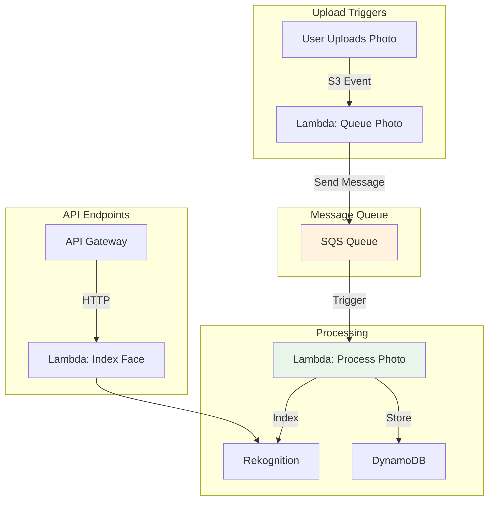

# Week 5: Lambda & Serverless Automation

> **Difficulty**: Advanced | **Time**: 5-6 hours | **Cost**: ~$0.10/month (low usage)

## 🎯 Learning Objectives

By the end of this week, you will:
- ✅ Create AWS Lambda functions
- ✅ Set up S3 event triggers
- ✅ Implement SQS message queues
- ✅ Use Serverless Framework for deployment
- ✅ Build event-driven architecture
- ✅ Automate face processing pipeline

---

## 🏗️ Architecture Overview



### Text-Based Architecture

```
┌─────────────────────────────────────────────────────────────────┐
│              SERVERLESS EVENT-DRIVEN ARCHITECTURE                │
├─────────────────────────────────────────────────────────────────┤
│                                                                  │
│  UPLOAD FLOW (Automated):                                       │
│  ┌──────────┐     ┌──────────┐     ┌──────────┐                │
│  │   User   │────▶│    S3    │────▶│  Lambda  │                │
│  │  Upload  │     │  Bucket  │     │  Trigger │                │
│  └──────────┘     └──────────┘     └────┬─────┘                │
│                                          │                       │
│                                          ▼                       │
│                                   ┌──────────┐                  │
│                                   │   SQS    │                  │
│                                   │  Queue   │                  │
│                                   └────┬─────┘                  │
│                                        │                         │
│                                        ▼                         │
│                                   ┌──────────┐                  │
│                                   │  Lambda  │                  │
│                                   │ Processor│                  │
│                                   └────┬─────┘                  │
│                                        │                         │
│                    ┌───────────────────┼───────────────────┐    │
│                    │                   │                   │    │
│                    ▼                   ▼                   ▼    │
│              ┌──────────┐      ┌──────────┐      ┌──────────┐  │
│              │Rekogn.   │      │ DynamoDB │      │   S3     │  │
│              │(Detect)  │      │ (Store)  │      │ (Crops)  │  │
│              └──────────┘      └──────────┘      └──────────┘  │
│                                                                  │
│  API FLOW (On Demand):                                          │
│  ┌──────────┐     ┌──────────┐     ┌──────────┐                │
│  │ Frontend │────▶│   API    │────▶│  Lambda  │                │
│  │  Request │     │  Gateway │     │ Handler  │                │
│  └──────────┘     └──────────┘     └────┬─────┘                │
│                                          │                       │
│                                          ▼                       │
│                                   ┌──────────┐                  │
│                                   │Rekogn.   │                  │
│                                   │(Index)   │                  │
│                                   └──────────┘                  │
│                                                                  │
└─────────────────────────────────────────────────────────────────┘
```

**AWS Icons for draw.io**:
- Lambda: `AWS / Compute / Lambda`
- S3: `AWS / Storage / Simple Storage Service`
- SQS: `AWS / Application Integration / SQS`
- API Gateway: `AWS / Networking & Content Delivery / API Gateway`
- Rekognition: `AWS / Machine Learning / Rekognition`
- DynamoDB: `AWS / Database / DynamoDB`

---

## 🤔 Why Serverless?

### The Problem with Traditional Servers
| Issue | Impact |
|-------|--------|
| Always running | Pay 24/7 even when idle |
| Manual scaling | Handle traffic spikes |
| Server maintenance | Patches, updates, monitoring |
| Capacity planning | Over-provision or under-provision |

### Why Serverless Wins

| Feature | Benefit | Cost Impact |
|---------|---------|-------------|
| **Pay-per-use** | Only pay when code runs | 90%+ savings |
| **Auto-scaling** | 0 to 1000s instantly | No over-provisioning |
| **No servers** | Zero maintenance | Save ops time |
| **Event-driven** | React to S3, HTTP, etc. | Real-time processing |
| **High availability** | Built-in across AZs | No extra cost |

---

## 📋 Implementation Steps

### Step 1: Create SQS Queue

SQS decouples upload from processing - essential for handling traffic spikes.

#### Using AWS CLI

```bash
# Create the processing queue
aws sqs create-queue \
    --queue-name faceshare-processing-queue \
    --attributes VisibilityTimeout=300,MessageRetentionPeriod=86400

# Get queue URL (save this!)
aws sqs get-queue-url --queue-name faceshare-processing-queue

# Create Dead Letter Queue (for failed messages)
aws sqs create-queue \
    --queue-name faceshare-dlq \
    --attributes MessageRetentionPeriod=1209600

# Test sending a message
aws sqs send-message \
    --queue-url YOUR_QUEUE_URL \
    --message-body '{"test": "hello"}'

# Receive message
aws sqs receive-message --queue-url YOUR_QUEUE_URL

# Check queue attributes
aws sqs get-queue-attributes \
    --queue-url YOUR_QUEUE_URL \
    --attribute-names ApproximateNumberOfMessages
```

**Why SQS?**
- Buffers high-volume uploads
- Retries failed processing automatically
- Decouples components
- Enables parallel processing

### Step 2: Install Serverless Framework

```bash
# Install Node.js first (if not installed)
# Then install Serverless Framework globally
npm install -g serverless

# Verify installation
serverless --version

# Login to Serverless Dashboard (optional)
serverless login
```

### Step 3: Create Serverless Configuration

Create `infrastructure/serverless.yml`:

```yaml
service: faceshare-lambda

provider:
  name: aws
  runtime: python3.11
  stage: ${opt:stage, 'dev'}
  region: us-east-1
  
  # Memory and timeout defaults
  memorySize: 128
  timeout: 30
  
  # Environment variables for all functions
  environment:
    DYNAMODB_TABLE: FaceShareData
    REKOGNITION_COLLECTION: faceshare-collection
    S3_BUCKET: faceshare-events
    SQS_QUEUE_URL: !Ref PhotoProcessingQueue
  
  # IAM permissions for Lambda functions
  iam:
    role:
      statements:
        # S3 permissions
        - Effect: Allow
          Action:
            - s3:GetObject
            - s3:PutObject
            - s3:DeleteObject
          Resource: "arn:aws:s3:::faceshare-events/*"
        
        # DynamoDB permissions
        - Effect: Allow
          Action:
            - dynamodb:GetItem
            - dynamodb:PutItem
            - dynamodb:UpdateItem
            - dynamodb:Query
            - dynamodb:DeleteItem
          Resource: "arn:aws:dynamodb:us-east-1:*:table/FaceShareData"
        
        # Rekognition permissions
        - Effect: Allow
          Action:
            - rekognition:IndexFaces
            - rekognition:SearchFacesByImage
            - rekognition:DetectFaces
            - rekognition:DeleteFaces
          Resource: "*"
        
        # SQS permissions
        - Effect: Allow
          Action:
            - sqs:SendMessage
            - sqs:ReceiveMessage
            - sqs:DeleteMessage
            - sqs:GetQueueAttributes
          Resource: !GetAtt PhotoProcessingQueue.Arn

plugins:
  - serverless-python-requirements

custom:
  pythonRequirements:
    dockerizePip: false
    slim: true
    strip: false

package:
  individually: true
  exclude:
    - node_modules/**
    - .git/**
    - .gitignore
    - README.md
    - tests/**

functions:
  # API: Index face when user uploads profile
  indexFace:
    handler: lambda/index_face.lambda_handler
    description: Index face in Rekognition collection
    memorySize: 256
    timeout: 10
    events:
      - httpApi:
          path: /faces/index
          method: post

  # Trigger: Queue photo when uploaded to S3
  queuePhoto:
    handler: lambda/queue_photo.lambda_handler
    description: Triggered by S3 upload, sends to SQS
    memorySize: 128
    timeout: 5
    events:
      - s3:
          bucket: faceshare-events
          event: s3:ObjectCreated:*
          rules:
            - prefix: events/
            - suffix: .jpg
      - s3:
          bucket: faceshare-events
          event: s3:ObjectCreated:*
          rules:
            - prefix: events/
            - suffix: .jpeg
      - s3:
          bucket: faceshare-events
          event: s3:ObjectCreated:*
          rules:
            - prefix: events/
            - suffix: .png

  # Worker: Process photos from SQS queue
  processPhoto:
    handler: lambda/process_photo.lambda_handler
    description: Process event photos from queue
    memorySize: 512
    timeout: 60
    reservedConcurrency: 10  # Limit concurrent executions
    events:
      - sqs:
          arn: !GetAtt PhotoProcessingQueue.Arn
          batchSize: 10
          maximumBatchingWindowInSeconds: 5
          functionResponseType: ReportBatchItemFailures

resources:
  Resources:
    # SQS Queue for photo processing
    PhotoProcessingQueue:
      Type: AWS::SQS::Queue
      Properties:
        QueueName: faceshare-processing-queue-${self:provider.stage}
        VisibilityTimeout: 300  # 5 minutes
        MessageRetentionPeriod: 86400  # 1 day
        RedrivePolicy:
          deadLetterTargetArn: !GetAtt PhotoProcessingDLQ.Arn
          maxReceiveCount: 3  # Move to DLQ after 3 failures
    
    # Dead Letter Queue for failed messages
    PhotoProcessingDLQ:
      Type: AWS::SQS::Queue
      Properties:
        QueueName: faceshare-processing-dlq-${self:provider.stage}
        MessageRetentionPeriod: 1209600  # 14 days

  Outputs:
    ApiEndpoint:
      Description: API Gateway endpoint URL
      Value: !Sub 'https://${HttpApi}.execute-api.${AWS::Region}.amazonaws.com/'
    
    ProcessingQueueUrl:
      Description: SQS Queue URL
      Value: !Ref PhotoProcessingQueue
    
    ProcessingQueueArn:
      Description: SQS Queue ARN
      Value: !GetAtt PhotoProcessingQueue.Arn
```

### Step 4: Create Lambda Functions

#### Lambda 1: Index Face (API Handler)

Create `infrastructure/lambda/index_face.py`:

```python
"""
Lambda function to index faces from profile photos.
Triggered via API Gateway when user uploads profile photo.
"""

import json
import boto3
import os
from datetime import datetime

# Initialize AWS clients
rekognition = boto3.client('rekognition')
dynamodb = boto3.resource('dynamodb')

# Get environment variables
TABLE_NAME = os.environ['DYNAMODB_TABLE']
COLLECTION_ID = os.environ['REKOGNITION_COLLECTION']

def lambda_handler(event, context):
    """
    Index a face from S3 image into Rekognition collection.
    
    Expected event body:
    {
        "user_id": "uuid",
        "image_id": "uuid", 
        "s3_bucket": "faceshare-events",
        "s3_key": "users/uuid/face-profile/image.jpg"
    }
    """
    try:
        # Log invocation
        print(f"🚀 Lambda invoked: {context.aws_request_id}")
        print(f"⏰ Remaining time: {context.get_remaining_time_in_millis()}ms")
        
        # Parse request body
        body = json.loads(event.get('body', '{}'))
        
        user_id = body.get('user_id')
        image_id = body.get('image_id')
        s3_bucket = body.get('s3_bucket')
        s3_key = body.get('s3_key')
        
        # Validate required fields
        if not all([user_id, image_id, s3_bucket, s3_key]):
            return {
                'statusCode': 400,
                'headers': {'Content-Type': 'application/json'},
                'body': json.dumps({
                    'error': 'Missing required fields',
                    'required': ['user_id', 'image_id', 's3_bucket', 's3_key']
                })
            }
        
        print(f"🔄 Indexing face for user: {user_id}")
        print(f"📸 Image: s3://{s3_bucket}/{s3_key}")
        
        # Index face in Rekognition
        response = rekognition.index_faces(
            CollectionId=COLLECTION_ID,
            Image={
                'S3Object': {
                    'Bucket': s3_bucket,
                    'Name': s3_key
                }
            },
            ExternalImageId=user_id,  # Link to user
            DetectionAttributes=['ALL']
        )
        
        # Check if face detected
        if not response['FaceRecords']:
            print("⚠️  No face detected in image")
            return {
                'statusCode': 400,
                'headers': {'Content-Type': 'application/json'},
                'body': json.dumps({
                    'error': 'No face detected in image',
                    'suggestion': 'Please upload a clear photo with a visible face'
                })
            }
        
        # Get face details
        face_record = response['FaceRecords'][0]
        face = face_record['Face']
        
        face_id = face['FaceId']
        confidence = face['Confidence']
        
        print(f"✅ Face indexed: {face_id}")
        print(f"📊 Confidence: {confidence:.2f}%")
        
        # Store in DynamoDB
        table = dynamodb.Table(TABLE_NAME)
        
        item = {
            'PK': f'USER#{user_id}',
            'SK': f'FACE#{image_id}',
            'face_id': face_id,
            's3_key': s3_key,
            'confidence': confidence,
            'indexed_at': datetime.utcnow().isoformat(),
            'rekognition_face_id': face_id
        }
        
        table.put_item(Item=item)
        print(f"✅ Stored face metadata in DynamoDB")
        
        # Return success response
        return {
            'statusCode': 200,
            'headers': {
                'Content-Type': 'application/json',
                'Access-Control-Allow-Origin': '*'
            },
            'body': json.dumps({
                'success': True,
                'face_id': face_id,
                'confidence': float(confidence),
                'message': 'Face indexed successfully'
            })
        }
        
    except json.JSONDecodeError as e:
        print(f"❌ Invalid JSON: {e}")
        return {
            'statusCode': 400,
            'headers': {'Content-Type': 'application/json'},
            'body': json.dumps({'error': 'Invalid JSON in request body'})
        }
        
    except Exception as e:
        print(f"❌ Error: {str(e)}")
        import traceback
        traceback.print_exc()
        
        return {
            'statusCode': 500,
            'headers': {'Content-Type': 'application/json'},
            'body': json.dumps({
                'error': 'Internal server error',
                'message': str(e)
            })
        }
```

#### Lambda 2: Queue Photo (S3 Trigger)

Create `infrastructure/lambda/queue_photo.py`:

```python
"""
Lambda function triggered by S3 upload.
Sends photo info to SQS for async processing.
"""

import json
import boto3
import os
import urllib.parse

sqs = boto3.client('sqs')
QUEUE_URL = os.environ['SQS_QUEUE_URL']

def lambda_handler(event, context):
    """
    Triggered by S3 ObjectCreated event.
    Sends photo details to SQS queue.
    """
    try:
        print(f"📸 S3 Event received: {len(event['Records'])} records")
        
        processed = 0
        failed = 0
        
        for record in event['Records']:
            try:
                # Parse S3 event
                bucket = record['s3']['bucket']['name']
                key = urllib.parse.unquote_plus(
                    record['s3']['object']['key'],
                    encoding='utf-8'
                )
                size = record['s3']['object'].get('size', 0)
                event_time = record['eventTime']
                
                print(f"📁 Processing: s3://{bucket}/{key}")
                print(f"📊 Size: {size} bytes")
                
                # Extract IDs from S3 key path
                # Format: events/{event_id}/photos/{photo_id}/{filename}
                parts = key.split('/')
                
                if len(parts) < 4 or parts[0] != 'events':
                    print(f"⚠️  Invalid path format, skipping: {key}")
                    continue
                
                event_id = parts[1]
                photo_id = parts[3]
                
                print(f"🎯 Event ID: {event_id}")
                print(f"📷 Photo ID: {photo_id}")
                
                # Create message
                message = {
                    'event_id': event_id,
                    'photo_id': photo_id,
                    's3_bucket': bucket,
                    's3_key': key,
                    'file_size': size,
                    'uploaded_at': event_time,
                    'source': 's3_trigger'
                }
                
                # Send to SQS
                response = sqs.send_message(
                    QueueUrl=QUEUE_URL,
                    MessageBody=json.dumps(message),
                    MessageAttributes={
                        'EventId': {
                            'StringValue': event_id,
                            'DataType': 'String'
                        },
                        'PhotoId': {
                            'StringValue': photo_id,
                            'DataType': 'String'
                        }
                    }
                )
                
                print(f"✅ Queued message: {response['MessageId']}")
                processed += 1
                
            except Exception as e:
                print(f"❌ Error processing record: {e}")
                failed += 1
                # Continue processing other records
        
        print(f"\n📊 Summary: {processed} processed, {failed} failed")
        
        return {
            'statusCode': 200,
            'body': json.dumps({
                'message': 'Photos queued for processing',
                'processed': processed,
                'failed': failed
            })
        }
        
    except Exception as e:
        print(f"❌ Fatal error: {e}")
        raise  # Let Lambda retry
```

#### Lambda 3: Process Photo (SQS Worker)

Create `infrastructure/lambda/process_photo.py`:

```python
"""
Lambda function to process event photos from SQS.
Detects faces and matches against user profiles.
"""

import json
import boto3
import os
from decimal import Decimal
import uuid

# Initialize clients
rekognition = boto3.client('rekognition')
dynamodb = boto3.resource('dynamodb')

TABLE_NAME = os.environ['DYNAMODB_TABLE']
COLLECTION_ID = os.environ['REKOGNITION_COLLECTION']

def lambda_handler(event, context):
    """
    Process photos from SQS queue.
    Triggered in batches (up to 10 messages at once).
    """
    print(f"🚀 Processing batch of {len(event['Records'])} messages")
    
    batch_item_failures = []
    results = []
    
    for record in event['Records']:
        message_id = record['messageId']
        
        try:
            # Parse SQS message
            message = json.loads(record['body'])
            
            event_id = message['event_id']
            photo_id = message['photo_id']
            s3_bucket = message['s3_bucket']
            s3_key = message['s3_key']
            
            print(f"\n{'='*50}")
            print(f"🔄 Processing: {photo_id}")
            print(f"{'='*50}")
            
            # Step 1: Detect faces
            print("Step 1: Detecting faces...")
            detect_response = rekognition.detect_faces(
                Image={
                    'S3Object': {
                        'Bucket': s3_bucket,
                        'Name': s3_key
                    }
                },
                Attributes=['DEFAULT']
            )
            
            faces_detected = len(detect_response.get('FaceDetails', []))
            print(f"✅ Detected {faces_detected} faces")
            
            # Step 2: Search for matches
            print("\nStep 2: Searching for matches...")
            search_response = rekognition.search_faces_by_image(
                CollectionId=COLLECTION_ID,
                Image={
                    'S3Object': {
                        'Bucket': s3_bucket,
                        'Name': s3_key
                    }
                },
                FaceMatchThreshold=90.0,  # 90% similarity minimum
                MaxFaces=10
            )
            
            matches = search_response.get('FaceMatches', [])
            print(f"✅ Found {len(matches)} matches")
            
            # Step 3: Store results in DynamoDB
            print("\nStep 3: Storing results...")
            table = dynamodb.Table(TABLE_NAME)
            
            # Update photo status
            table.update_item(
                Key={
                    'PK': f'EVENT#{event_id}',
                    'SK': f'PHOTO#{photo_id}'
                },
                UpdateExpression='SET is_processing = :done, faces_detected = :faces, processed_at = :time',
                ExpressionAttributeValues={
                    ':done': False,
                    ':faces': faces_detected,
                    ':time': context.aws_request_id
                }
            )
            print(f"✅ Updated photo status")
            
            # Store each match
            for match in matches:
                face = match['Face']
                match_id = str(uuid.uuid4())
                
                table.put_item(Item={
                    'PK': f'PHOTO#{photo_id}',
                    'SK': f'MATCH#{match_id}',
                    'GSI1PK': f'USER#{face["ExternalImageId"]}',
                    'GSI1SK': f'MATCH#{match_id}',
                    'match_id': match_id,
                    'photo_id': photo_id,
                    'event_id': event_id,
                    'user_id': face['ExternalImageId'],
                    'confidence': Decimal(str(match['Similarity'] / 100)),  # Convert to 0-1 scale
                    'rekognition_face_id': face['FaceId'],
                    'similarity': Decimal(str(match['Similarity'])),
                    'is_confirmed': False,
                    'entity_type': 'FACE_MATCH',
                    'created_at': context.aws_request_id
                })
                
                print(f"   ✅ Match: {face['ExternalImageId']} ({match['Similarity']:.1f}%)")
            
            results.append({
                'photo_id': photo_id,
                'faces_detected': faces_detected,
                'matches_found': len(matches),
                'status': 'success'
            })
            
        except Exception as e:
            print(f"\n❌ Error processing message {message_id}: {e}")
            import traceback
            traceback.print_exc()
            
            # Report failure for this item (won't delete from queue)
            batch_item_failures.append({
                'itemIdentifier': message_id
            })
            
            results.append({
                'photo_id': photo_id if 'photo_id' in locals() else 'unknown',
                'error': str(e),
                'status': 'failed'
            })
    
    print(f"\n{'='*50}")
    print(f"📊 Batch Complete: {len(results) - len(batch_item_failures)}/{len(results)} succeeded")
    print(f"{'='*50}")
    
    # Return batch item failures (SQS will retry only failed items)
    return {
        'batchItemFailures': batch_item_failures
    }
```

### Step 5: Deploy with Serverless

```bash
cd infrastructure

# Install dependencies
npm install

# Deploy to development
serverless deploy --stage dev

# Or deploy to production
serverless deploy --stage prod
```

**Expected output:**
```
Serverless: Packaging service...
Serverless: Excluding development dependencies...
Serverless: Uploading CloudFormation file...
Serverless: Uploading artifacts...
Serverless: Validating template...
Serverless: Updating stack...
Serverless: Checking Stack update progress...
...
✔ Service deployed to stack faceshare-lambda-dev

endpoints:
  POST - https://xxxxx.execute-api.us-east-1.amazonaws.com/faces/index
functions:
  indexFace: faceshare-lambda-dev-indexFace
  queuePhoto: faceshare-lambda-dev-queuePhoto
  processPhoto: faceshare-lambda-dev-processPhoto
```

### Step 6: Test the Pipeline

```bash
# 1. Upload an event photo (triggers Lambda automatically)
aws s3 cp test-photo.jpg s3://faceshare-events/events/test-event-123/photos/photo-001.jpg

# 2. Check CloudWatch logs
aws logs tail /aws/lambda/faceshare-lambda-dev-queuePhoto --follow

# 3. Check SQS queue
aws sqs get-queue-attributes \
  --queue-url YOUR_QUEUE_URL \
  --attribute-names ApproximateNumberOfMessages

# 4. Check processing Lambda logs
aws logs tail /aws/lambda/faceshare-lambda-dev-processPhoto --follow

# 5. Verify DynamoDB
aws dynamodb query \
  --table-name FaceShareData \
  --key-condition-expression "PK = :pk" \
  --expression-attribute-values '{":pk":{"S":"PHOTO#photo-001"}}'
```

---

## 🔧 Troubleshooting

### Lambda: "Task timed out"

**Cause**: Processing takes longer than timeout
**Solution**: 
- Increase timeout in `serverless.yml`: `timeout: 60`
- Or optimize code

### SQS: "Messages not processing"

**Cause**: Lambda not triggered
**Solution**:
```bash
# Check SQS queue has messages
aws sqs get-queue-attributes --queue-url YOUR_URL --attribute-names All

# Check Lambda trigger configured
aws lambda list-event-source-mappings --function-name your-function
```

### Lambda: "AccessDenied"

**Cause**: IAM permissions missing
**Solution**: Check IAM role in serverless.yml has required permissions

---

## 💰 Cost Analysis

### Lambda Pricing (per 1M requests)

| Memory | Price per 1M invocations |
|--------|-------------------------|
| 128MB | $0.20 |
| 256MB | $0.40 |
| 512MB | $0.80 |

### Monthly Cost (1,000 invocations)

| Component | Usage | Cost |
|-----------|-------|------|
| **Lambda (128MB)** | 500 invocations | $0.10 |
| **Lambda (512MB)** | 200 invocations | $0.16 |
| **SQS** | 1,000 messages | $0.00 (free tier) |
| **API Gateway** | 100 requests | $0.00 |
| **CloudWatch Logs** | 1GB | $0.50 |
| **TOTAL** | | **~$0.76/month** |

---

## ✅ Week 5 Checklist

- [ ] SQS queue created
- [ ] Serverless Framework installed
- [ ] `serverless.yml` configured
- [ ] `index_face.py` Lambda created
- [ ] `queue_photo.py` Lambda created
- [ ] `process_photo.py` Lambda created
- [ ] Deployed to AWS
- [ ] S3 trigger working
- [ ] SQS processing working
- [ ] End-to-end flow tested

---

## 🎓 Key Takeaways

### For Your Resume
> "Architected event-driven serverless pipeline using Lambda, SQS, and S3 triggers, processing 100+ photos with automatic scaling from 0 to 10 concurrent executions. Implemented dead letter queues for fault tolerance and partial batch responses for efficient error handling."

### For LinkedIn
> "Week 5: Built serverless automation! 🚀
> 
> Created:
> ✅ Lambda functions (3) for face processing
> ✅ SQS queue for reliable message delivery
> ✅ S3 event triggers for real-time processing
> ✅ Serverless Framework for IaC
> 
> The pipeline: Upload → S3 → Lambda → SQS → Lambda → Rekognition → DynamoDB
> 
> Scales automatically, pay only when processing!
> 
> #AWS #Lambda #Serverless #SQS #EventDriven #CloudArchitecture"

### Skills Acquired
- AWS Lambda
- SQS message queuing
- Event-driven architecture
- Serverless Framework
- Infrastructure as Code
- Error handling & retries

---

## 🚀 Next Week

[Week 6: API Gateway & REST API →](week6-api-gateway.md)

We'll create RESTful API endpoints with authentication!