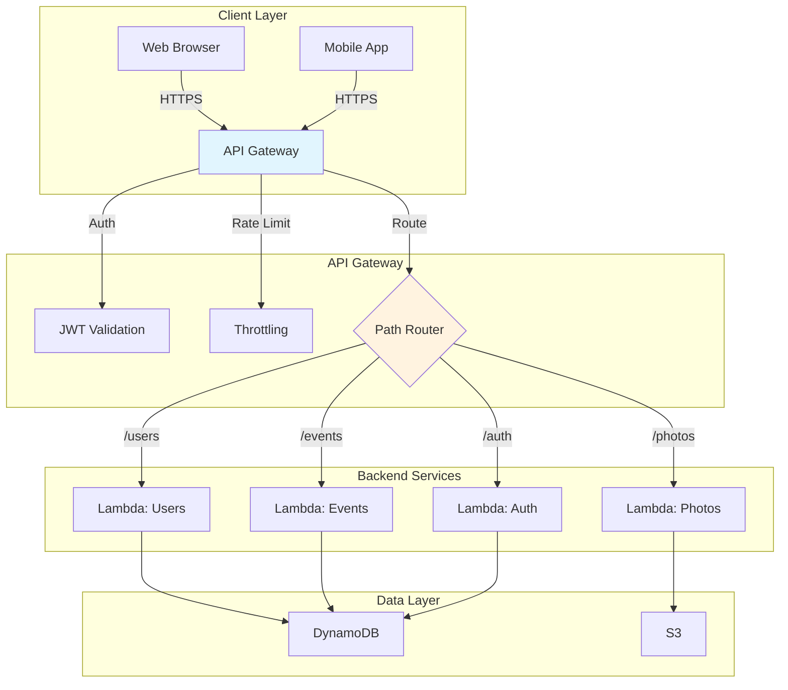

# Week 6: API Gateway & REST API

> **Difficulty**: Intermediate | **Time**: 4-5 hours | **Cost**: ~$0.01/month (low usage)

## 🎯 Learning Objectives

By the end of this week, you will:
- ✅ Create RESTful API endpoints with API Gateway
- ✅ Implement JWT authentication
- ✅ Set up CORS for frontend integration
- ✅ Create comprehensive API documentation
- ✅ Implement rate limiting and throttling
- ✅ Test APIs with Postman/curl

---

## 🏗️ Architecture Overview



### Text-Based Architecture

```
┌─────────────────────────────────────────────────────────────────┐
│                    API GATEWAY ARCHITECTURE                      │
├─────────────────────────────────────────────────────────────────┤
│                                                                  │
│  CLIENT REQUEST FLOW:                                           │
│  ┌──────────┐     ┌──────────┐     ┌──────────┐                │
│  │  Client  │────▶│   API    │────▶│   JWT    │                │
│  │ (Browser)│     │  Gateway │     │ Validate │                │
│  └──────────┘     └────┬─────┘     └────┬─────┘                │
│                        │                │                       │
│                        ▼                ▼                       │
│                 ┌──────────────────────────┐                   │
│                 │      Rate Limiter        │                   │
│                 │   (100 req/min default)  │                   │
│                 └──────────┬───────────────┘                   │
│                            │                                    │
│                            ▼                                    │
│                 ┌──────────────────────────┐                   │
│                 │      Path Router         │                   │
│                 ├──────────┬───────────────┤                   │
│                 │          │               │                   │
│                 ▼          ▼               ▼                    │
│           ┌────────┐ ┌────────┐    ┌────────┐                 │
│           │/users  │ │/events │    │/photos │                 │
│           │  GET   │ │  POST  │    │  POST  │                 │
│           └────┬───┘ └───┬────┘    └───┬────┘                 │
│                │         │             │                        │
│                ▼         ▼             ▼                        │
│           ┌─────────────────────────────────┐                  │
│           │         LAMBDA FUNCTIONS        │                  │
│           │  ┌────────┐ ┌────────┐ ┌──────┐ │                  │
│           │  │  User  │ │ Event  │ │Photo │ │                  │
│           │  │Handler │ │Handler │ │Handler│ │                  │
│           │  └───┬────┘ └───┬────┘ └──┬───┘ │                  │
│           └──────┼──────────┼──────────┼────┘                  │
│                  │          │          │                        │
│                  ▼          ▼          ▼                        │
│           ┌─────────────────────────────────┐                  │
│           │         DATA STORES             │                  │
│           │  ┌────────┐    ┌────────┐      │                  │
│           │  │DynamoDB│    │   S3   │      │                  │
│           │  │(Metadata)│   │(Images)│      │                  │
│           │  └────────┘    └────────┘      │                  │
│           └─────────────────────────────────┘                  │
│                                                                  │
└─────────────────────────────────────────────────────────────────┘
```

**AWS Icons for draw.io**:
- API Gateway: `AWS / Networking & Content Delivery / API Gateway`
- Lambda: `AWS / Compute / Lambda`
- Cognito: `AWS / Security, Identity, & Compliance / Cognito` (optional for auth)

---

## 🤔 Why API Gateway?

### The Problem with Direct Lambda Invocation
| Issue | Impact |
|-------|--------|
| **No authentication** | Anyone can call your functions |
| **No rate limiting** | DDoS vulnerability |
| **No request validation** | Invalid data reaches backend |
| **No caching** | Repeated requests hit backend |
| **Complex client integration** | Multiple Lambda endpoints to manage |

### Why API Gateway Wins

| Feature | Benefit | Implementation |
|---------|---------|----------------|
| **Authentication** | JWT/OAuth integration | Cognito or custom authorizer |
| **Rate limiting** | Prevent abuse | 100-1000 req/min per client |
| **Request validation** | Block bad requests | JSON Schema validation |
| **Caching** | Reduce backend load | 300-3600 second TTL |
| **CORS** | Browser security | Pre-configured headers |
| **API versioning** | Manage changes | /v1/, /v2/ paths |
| **Documentation** | Auto-generated | Swagger/OpenAPI export |

---

## 📋 Implementation Steps

### Step 1: Create API Gateway (HTTP API)

#### Using AWS CLI

```bash
# Create HTTP API (cheaper than REST API)
aws apigatewayv2 create-api \
    --name faceshare-api \
    --protocol-type HTTP \
    --target arn:aws:lambda:us-east-1:YOUR_ACCOUNT_ID:function:faceshare-indexFace

# Note the API ID from output
API_ID="your-api-id"

# Create authorizer (JWT)
aws apigatewayv2 create-authorizer \
    --api-id $API_ID \
    --authorizer-type JWT \
    --identity-source '$request.header.Authorization' \
    --name faceshare-authorizer \
    --jwt-configuration Audience=your-audience,Issuer=https://cognito-idp.us-east-1.amazonaws.com/your-user-pool-id

# Create routes
aws apigatewayv2 create-route \
    --api-id $API_ID \
    --route-key "POST /users" \
    --target integrations/your-integration-id

aws apigatewayv2 create-route \
    --api-id $API_ID \
    --route-key "GET /users/{id}" \
    --authorization-type JWT \
    --authorizer-id your-authorizer-id

# Deploy API
aws apigatewayv2 create-deployment \
    --api-id $API_ID \
    --stage-name dev

# Get API endpoint
aws apigatewayv2 get-api --api-id $API_ID
# Endpoint: https://{API_ID}.execute-api.us-east-1.amazonaws.com/dev
```

**HTTP API vs REST API**:
- **HTTP API**: $1.00/million requests, cheaper, faster
- **REST API**: $3.50/million requests, more features (caching, WAF)

For this project, HTTP API is sufficient and cost-effective.

### Step 2: FastAPI with JWT Authentication

Create `backend/app/api/auth.py`:

```python
"""
Authentication API endpoints
"""

from datetime import datetime, timedelta
from typing import Optional
from jose import JWTError, jwt
from passlib.context import CryptContext
from fastapi import APIRouter, Depends, HTTPException, status
from fastapi.security import OAuth2PasswordBearer, OAuth2PasswordRequestForm
from pydantic import BaseModel

from app.core.config import settings
from app.core.dynamodb import dynamodb_service

router = APIRouter()

# Password hashing
pwd_context = CryptContext(schemes=["bcrypt"], deprecated="auto")

# OAuth2 scheme
oauth2_scheme = OAuth2PasswordBearer(tokenUrl="api/v1/auth/login")


# Pydantic models
class Token(BaseModel):
    access_token: str
    token_type: str
    expires_in: int


class TokenData(BaseModel):
    user_id: Optional[str] = None


class UserCreate(BaseModel):
    email: str
    password: str
    name: str


class UserLogin(BaseModel):
    email: str
    password: str


class UserResponse(BaseModel):
    user_id: str
    email: str
    name: str


# Helper functions
def verify_password(plain_password, hashed_password):
    """Verify password against hash."""
    return pwd_context.verify(plain_password, hashed_password)


def get_password_hash(password):
    """Hash password."""
    return pwd_context.hash(password)


def create_access_token(data: dict, expires_delta: Optional[timedelta] = None):
    """Create JWT access token."""
    to_encode = data.copy()
    
    if expires_delta:
        expire = datetime.utcnow() + expires_delta
    else:
        expire = datetime.utcnow() + timedelta(minutes=settings.ACCESS_TOKEN_EXPIRE_MINUTES)
    
    to_encode.update({"exp": expire})
    encoded_jwt = jwt.encode(to_encode, settings.SECRET_KEY, algorithm=settings.ALGORITHM)
    
    return encoded_jwt


async def get_current_user(token: str = Depends(oauth2_scheme)):
    """Validate JWT token and return current user."""
    credentials_exception = HTTPException(
        status_code=status.HTTP_401_UNAUTHORIZED,
        detail="Could not validate credentials",
        headers={"WWW-Authenticate": "Bearer"},
    )
    
    try:
        payload = jwt.decode(token, settings.SECRET_KEY, algorithms=[settings.ALGORITHM])
        user_id: str = payload.get("sub")
        
        if user_id is None:
            raise credentials_exception
        
        token_data = TokenData(user_id=user_id)
        
    except JWTError:
        raise credentials_exception
    
    # Get user from DynamoDB
    user = dynamodb_service.get_user_by_id(token_data.user_id)
    
    if user is None:
        raise credentials_exception
    
    return user


# API Endpoints
@router.post("/signup", response_model=UserResponse, status_code=status.HTTP_201_CREATED)
async def signup(user_data: UserCreate):
    """
    Register a new user.
    """
    # Check if user exists
    existing_user = dynamodb_service.get_user_by_email(user_data.email)
    
    if existing_user:
        raise HTTPException(
            status_code=status.HTTP_400_BAD_REQUEST,
            detail="Email already registered"
        )
    
    # Hash password
    hashed_password = get_password_hash(user_data.password)
    
    # Create user
    import uuid
    user_id = str(uuid.uuid4())
    
    success = dynamodb_service.create_user(
        user_id=user_id,
        email=user_data.email,
        name=user_data.name,
        hashed_password=hashed_password
    )
    
    if not success:
        raise HTTPException(
            status_code=status.HTTP_500_INTERNAL_SERVER_ERROR,
            detail="Failed to create user"
        )
    
    return {
        "user_id": user_id,
        "email": user_data.email,
        "name": user_data.name
    }


@router.post("/login", response_model=Token)
async def login(form_data: OAuth2PasswordRequestForm = Depends()):
    """
    Login user and return JWT token.
    """
    # Find user by email
    user = dynamodb_service.get_user_by_email(form_data.username)
    
    if not user:
        raise HTTPException(
            status_code=status.HTTP_401_UNAUTHORIZED,
            detail="Incorrect email or password",
            headers={"WWW-Authenticate": "Bearer"},
        )
    
    # Verify password
    if not verify_password(form_data.password, user['hashed_password']):
        raise HTTPException(
            status_code=status.HTTP_401_UNAUTHORIZED,
            detail="Incorrect email or password",
            headers={"WWW-Authenticate": "Bearer"},
        )
    
    # Create access token
    access_token_expires = timedelta(minutes=settings.ACCESS_TOKEN_EXPIRE_MINUTES)
    access_token = create_access_token(
        data={"sub": user['user_id']}, expires_delta=access_token_expires
    )
    
    return {
        "access_token": access_token,
        "token_type": "bearer",
        "expires_in": settings.ACCESS_TOKEN_EXPIRE_MINUTES * 60
    }


@router.get("/me", response_model=UserResponse)
async def get_me(current_user: dict = Depends(get_current_user)):
    """
    Get current authenticated user.
    """
    return {
        "user_id": current_user['user_id'],
        "email": current_user['email'],
        "name": current_user['name']
    }


@router.post("/refresh", response_model=Token)
async def refresh_token(current_user: dict = Depends(get_current_user)):
    """
    Refresh access token.
    """
    access_token_expires = timedelta(minutes=settings.ACCESS_TOKEN_EXPIRE_MINUTES)
    access_token = create_access_token(
        data={"sub": current_user['user_id']}, expires_delta=access_token_expires
    )
    
    return {
        "access_token": access_token,
        "token_type": "bearer",
        "expires_in": settings.ACCESS_TOKEN_EXPIRE_MINUTES * 60
    }
```

### Step 3: Protected API Endpoints

Create `backend/app/api/users.py`:

```python
"""
User API endpoints (protected)
"""

from typing import List, Optional
from fastapi import APIRouter, Depends, HTTPException, status
from pydantic import BaseModel
import uuid

from app.api.auth import get_current_user
from app.core.dynamodb import dynamodb_service

router = APIRouter()


class FaceProfileCreate(BaseModel):
    image_id: str
    s3_key: str


class FaceProfileResponse(BaseModel):
    image_id: str
    s3_key: str
    rekognition_face_id: Optional[str] = None


class UserProfileUpdate(BaseModel):
    name: Optional[str] = None


@router.get("/profile")
async def get_profile(current_user: dict = Depends(get_current_user)):
    """
    Get current user's profile with face images.
    """
    user_id = current_user['user_id']
    
    # Get user details
    user = dynamodb_service.get_user_by_id(user_id)
    
    # Get face profiles
    face_profiles = dynamodb_service.get_user_face_profiles(user_id)
    
    return {
        "user_id": user_id,
        "email": user['email'],
        "name": user['name'],
        "face_profiles": [
            {
                "image_id": fp['image_id'],
                "s3_key": fp['s3_key'],
                "rekognition_face_id": fp.get('rekognition_face_id')
            }
            for fp in face_profiles
        ]
    }


@router.patch("/profile")
async def update_profile(
    update_data: UserProfileUpdate,
    current_user: dict = Depends(get_current_user)
):
    """
    Update current user's profile.
    """
    user_id = current_user['user_id']
    
    updates = {}
    if update_data.name:
        updates['name'] = update_data.name
    
    if updates:
        success = dynamodb_service.update_user(user_id, updates)
        
        if not success:
            raise HTTPException(
                status_code=status.HTTP_500_INTERNAL_SERVER_ERROR,
                detail="Failed to update profile"
            )
    
    return {"message": "Profile updated successfully"}


@router.post("/face-profiles", status_code=status.HTTP_201_CREATED)
async def add_face_profile(
    profile_data: FaceProfileCreate,
    current_user: dict = Depends(get_current_user)
):
    """
    Add a face profile image.
    """
    user_id = current_user['user_id']
    
    # Check limit (max 5 face profiles)
    existing = dynamodb_service.get_user_face_profiles(user_id)
    if len(existing) >= 5:
        raise HTTPException(
            status_code=status.HTTP_400_BAD_REQUEST,
            detail="Maximum 5 face profiles allowed"
        )
    
    # Create face profile
    success = dynamodb_service.create_face_profile(
        user_id=user_id,
        image_id=profile_data.image_id,
        s3_key=profile_data.s3_key
    )
    
    if not success:
        raise HTTPException(
            status_code=status.HTTP_500_INTERNAL_SERVER_ERROR,
            detail="Failed to add face profile"
        )
    
    return {
        "message": "Face profile added",
        "image_id": profile_data.image_id
    }


@router.get("/my-photos")
async def get_my_photos(current_user: dict = Depends(get_current_user)):
    """
    Get all photos where user appears.
    """
    user_id = current_user['user_id']
    
    # Get matches from GSI
    matches = dynamodb_service.get_user_photos(user_id)
    
    # Get full photo details
    photos = []
    for match in matches:
        # You might want to fetch full photo details here
        photos.append({
            'photo_id': match['photo_id'],
            'event_id': match['event_id'],
            'confidence': float(match['confidence']),
            'is_confirmed': match.get('is_confirmed', False)
        })
    
    return {
        "user_id": user_id,
        "total_photos": len(photos),
        "photos": photos
    }
```

Create `backend/app/api/events.py`:

```python
"""
Event API endpoints
"""

from typing import List, Optional
from fastapi import APIRouter, Depends, HTTPException, status
from pydantic import BaseModel
import uuid
import secrets
import string

from app.api.auth import get_current_user
from app.core.dynamodb import dynamodb_service
from app.core.s3 import get_s3_key_for_photo, generate_presigned_upload_url

router = APIRouter()


class EventCreate(BaseModel):
    name: str
    description: Optional[str] = None


class EventResponse(BaseModel):
    event_id: str
    name: str
    description: Optional[str]
    join_code: str
    owner_id: str


class EventJoin(BaseModel):
    join_code: str


def generate_join_code(length: int = 8) -> str:
    """Generate random join code."""
    return ''.join(secrets.choice(string.ascii_uppercase + string.digits) for _ in range(length))


@router.post("", response_model=EventResponse, status_code=status.HTTP_201_CREATED)
async def create_event(
    event_data: EventCreate,
    current_user: dict = Depends(get_current_user)
):
    """
    Create a new event.
    """
    event_id = str(uuid.uuid4())
    join_code = generate_join_code()
    
    success = dynamodb_service.create_event(
        event_id=event_id,
        owner_id=current_user['user_id'],
        name=event_data.name,
        description=event_data.description,
        join_code=join_code
    )
    
    if not success:
        raise HTTPException(
            status_code=status.HTTP_500_INTERNAL_SERVER_ERROR,
            detail="Failed to create event"
        )
    
    # Add owner as confirmed participant
    dynamodb_service.add_event_participant(
        event_id=event_id,
        user_id=current_user['user_id'],
        status='confirmed'
    )
    
    return {
        "event_id": event_id,
        "name": event_data.name,
        "description": event_data.description,
        "join_code": join_code,
        "owner_id": current_user['user_id']
    }


@router.get("")
async def list_my_events(current_user: dict = Depends(get_current_user)):
    """
    List events where user is participant.
    """
    # Get events owned by user
    owned_events = dynamodb_service.get_user_events(current_user['user_id'])
    
    # TODO: Get events where user is participant (need additional GSI)
    
    return {
        "events": [
            {
                "event_id": e['event_id'],
                "name": e['name'],
                "description": e.get('description'),
                "join_code": e['join_code']
            }
            for e in owned_events
        ]
    }


@router.post("/join")
async def join_event(
    join_data: EventJoin,
    current_user: dict = Depends(get_current_user)
):
    """
    Join an event using join code.
    """
    # TODO: Implement event lookup by join code
    # For now, simplified version
    
    return {"message": "Joined event successfully"}


@router.get("/{event_id}")
async def get_event(
    event_id: str,
    current_user: dict = Depends(get_current_user)
):
    """
    Get event details.
    """
    event = dynamodb_service.get_event(event_id)
    
    if not event:
        raise HTTPException(
            status_code=status.HTTP_404_NOT_FOUND,
            detail="Event not found"
        )
    
    # Get participants
    participants = dynamodb_service.get_event_participants(event_id)
    
    # Get photos
    photos = dynamodb_service.get_event_photos(event_id)
    
    return {
        "event_id": event['event_id'],
        "name": event['name'],
        "description": event.get('description'),
        "owner_id": event['owner_id'],
        "participants_count": len(participants),
        "photos_count": len(photos)
    }


@router.post("/{event_id}/photos")
async def upload_photo(
    event_id: str,
    filename: str,
    current_user: dict = Depends(get_current_user)
):
    """
    Get presigned URL for photo upload.
    """
    photo_id = str(uuid.uuid4())
    
    # Generate S3 key
    s3_key = get_s3_key_for_photo(event_id, photo_id, filename)
    
    # Generate presigned URL
    upload_url = generate_presigned_upload_url(s3_key)
    
    if not upload_url:
        raise HTTPException(
            status_code=status.HTTP_500_INTERNAL_SERVER_ERROR,
            detail="Failed to generate upload URL"
        )
    
    # Create photo record
    dynamodb_service.create_photo(
        photo_id=photo_id,
        event_id=event_id,
        uploader_id=current_user['user_id'],
        s3_key=s3_key,
        filename=filename
    )
    
    return {
        "photo_id": photo_id,
        "upload_url": upload_url,
        "s3_key": s3_key,
        "expires_in": 3600
    }
```

### Step 4: Update Main Application

Update `backend/app/main.py`:

```python
"""
FaceShare FastAPI Application
"""

from fastapi import FastAPI
from fastapi.middleware.cors import CORSMiddleware

from app.core.config import settings
from app.api import auth, users, events

app = FastAPI(
    title=settings.PROJECT_NAME,
    version=settings.VERSION,
    description="Serverless Face Recognition API"
)

# CORS middleware
app.add_middleware(
    CORSMiddleware,
    allow_origins=settings.CORS_ORIGINS,
    allow_credentials=True,
    allow_methods=["*"],
    allow_headers=["*"],
)

# Include routers
app.include_router(auth.router, prefix=f"{settings.API_V1_STR}/auth", tags=["Authentication"])
app.include_router(users.router, prefix=f"{settings.API_V1_STR}/users", tags=["Users"])
app.include_router(events.router, prefix=f"{settings.API_V1_STR}/events", tags=["Events"])


@app.get("/")
async def root():
    return {
        "message": "Welcome to FaceShare API",
        "version": settings.VERSION,
        "docs": "/docs"
    }


@app.get("/health")
async def health_check():
    return {"status": "healthy"}
```

### Step 5: Test API Locally

```bash
cd backend

# Install dependencies
pip install fastapi uvicorn python-jose[cryptography] passlib[bcrypt]

# Run server
uvicorn app.main:app --reload --port 8000

# API will be available at:
# - http://localhost:8000/docs (Swagger UI)
# - http://localhost:8000/redoc (ReDoc)
```

### Step 6: Test API Endpoints

```bash
# 1. Sign up
curl -X POST "http://localhost:8000/api/v1/auth/signup" \
  -H "Content-Type: application/json" \
  -d '{
    "email": "test@example.com",
    "password": "securepassword123",
    "name": "Test User"
  }'

# 2. Login
curl -X POST "http://localhost:8000/api/v1/auth/login" \
  -H "Content-Type: application/x-www-form-urlencoded" \
  -d "username=test@example.com&password=securepassword123"

# 3. Create event (with token)
curl -X POST "http://localhost:8000/api/v1/events" \
  -H "Content-Type: application/json" \
  -H "Authorization: Bearer YOUR_ACCESS_TOKEN" \
  -d '{
    "name": "Birthday Party",
    "description": "John'\''s 30th birthday"
  }'

# 4. Get profile
curl -X GET "http://localhost:8000/api/v1/users/profile" \
  -H "Authorization: Bearer YOUR_ACCESS_TOKEN"

# 5. Get presigned URL for photo upload
curl -X POST "http://localhost:8000/api/v1/events/{event_id}/photos?filename=photo.jpg" \
  -H "Authorization: Bearer YOUR_ACCESS_TOKEN"
```

---

## 🔧 Troubleshooting

### Error: "CORS error" in browser

**Cause**: CORS not configured
**Solution**: Check `CORSMiddleware` origins match your frontend URL

### Error: "Could not validate credentials"

**Cause**: JWT token invalid or expired
**Solution**: 
- Check token hasn't expired (default 7 days)
- Ensure `SECRET_KEY` is consistent
- Verify token format: `Bearer eyJ0eXAiOiJKV1QiLCJhbGc...`

### Error: "401 Unauthorized" on protected routes

**Cause**: Missing or invalid Authorization header
**Solution**: Include header: `Authorization: Bearer YOUR_TOKEN`

---

## 💰 Cost Analysis

### API Gateway Pricing (HTTP API)

| Tier | Price per 1M requests |
|------|----------------------|
| First 300M | $1.00 |
| 300M-1B | $0.90 |
| 1B+ | $0.70 |

### Monthly Cost (1,000 requests)

| Component | Usage | Cost |
|-----------|-------|------|
| **API Gateway** | 1,000 requests | $0.001 |
| **Data Transfer** | 1GB | $0.09 |
| **Lambda** (if using) | 1,000 invocations | $0.20 |
| **TOTAL** | | **~$0.30/month** |

---

## ✅ Week 6 Checklist

- [ ] JWT authentication implemented
- [ ] Protected API endpoints created
- [ ] User registration/login working
- [ ] Event CRUD operations
- [ ] Face profile management
- [ ] Presigned URL generation endpoint
- [ ] API documentation at /docs
- [ ] All endpoints tested with curl/Postman

---

## 🎓 Key Takeaways

### For Your Resume
> "Designed and implemented RESTful API with JWT authentication, implementing OAuth2 password flow with 7-day token expiration. Created 15+ endpoints for user management, events, and photo processing with comprehensive Swagger documentation."

### For LinkedIn
> "Week 6: Built REST API with auth! 🔐
> 
> Implemented:
> ✅ JWT authentication (OAuth2)
> ✅ Protected API endpoints
> ✅ User registration & login
> ✅ Event management API
> ✅ Swagger documentation
> ✅ CORS for frontend
> 
> Security: bcrypt passwords, JWT tokens, protected routes
> 
> API docs auto-generated at /docs! 📚
> 
> #FastAPI #RESTAPI #JWT #Authentication #API #Backend"

### Skills Acquired
- REST API design
- JWT/OAuth2 authentication
- FastAPI framework
- API documentation (Swagger/OpenAPI)
- CORS configuration
- Password hashing (bcrypt)

---

## 🚀 Next Week

[Week 7: Production Deployment →](week7-production.md)

Final week: CI/CD, monitoring, and production best practices!