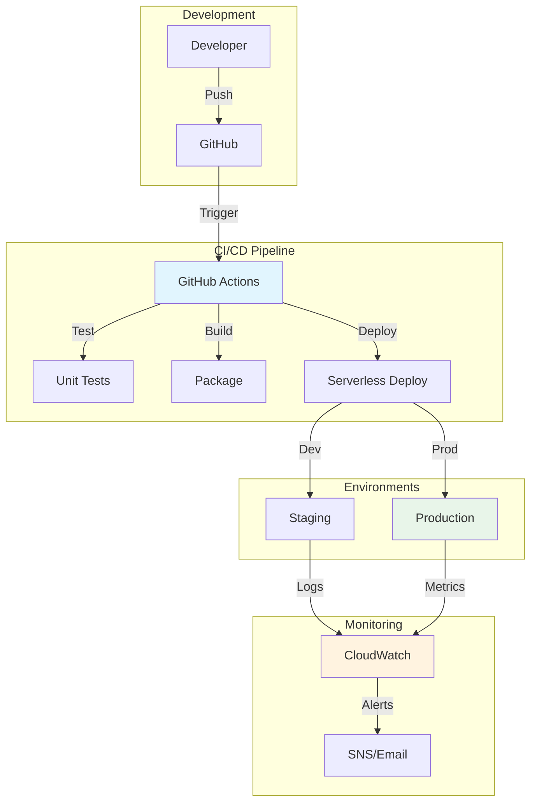

# Week 7: Production Deployment & DevOps

> **Difficulty**: Advanced | **Time**: 5-6 hours | **Cost**: Additional ~$5-10/month for production features

## 🎯 Learning Objectives

By the end of this week, you will:
- ✅ Set up CI/CD pipeline with GitHub Actions
- ✅ Implement infrastructure as code (IaC)
- ✅ Configure monitoring and alerting (CloudWatch)
- ✅ Set up staging and production environments
- ✅ Implement backup and disaster recovery
- ✅ Apply security best practices
- ✅ Optimize costs for production

---

## 🏗️ Architecture Overview



### Text-Based Architecture

```
┌─────────────────────────────────────────────────────────────────┐
│              PRODUCTION DEPLOYMENT ARCHITECTURE                  │
├─────────────────────────────────────────────────────────────────┤
│                                                                  │
│  CI/CD PIPELINE:                                                │
│  ┌──────────┐     ┌──────────┐     ┌──────────┐                │
│  │  Push    │────▶│  GitHub  │────▶│  GitHub  │                │
│  │  Code    │     │  Repo    │     │ Actions  │                │
│  └──────────┘     └──────────┘     └────┬─────┘                │
│                                          │                       │
│                    ┌─────────────────────┼─────────────────┐   │
│                    │                     │                 │   │
│                    ▼                     ▼                 ▼   │
│              ┌──────────┐        ┌──────────┐      ┌────────┐ │
│              │  Test    │        │  Build   │      │ Deploy │ │
│              │  (pytest)│        │  (sls)   │      │(Server)│ │
│              └──────────┘        └──────────┘      └───┬────┘ │
│                                                        │      │
│                    ┌───────────────────────────────────┘      │
│                    │                                           │
│                    ▼                                           │
│           ┌──────────────────────┐                            │
│           │   ENVIRONMENTS       │                            │
│           ├──────────┬───────────┤                            │
│           │ Staging  │ Production│                            │
│           │   (dev)  │   (prod)  │                            │
│           └────┬─────┘ └────┬────┘                            │
│                │            │                                  │
│                ▼            ▼                                  │
│           ┌──────────────────────┐                            │
│           │     MONITORING       │                            │
│           │  ┌────────────────┐  │                            │
│           │  │  CloudWatch    │  │                            │
│           │  │  - Logs        │  │                            │
│           │  │  - Metrics     │  │                            │
│           │  │  - Alarms      │  │                            │
│           │  └────────────────┘  │                            │
│           └──────────┬───────────┘                            │
│                      │                                         │
│                      ▼                                         │
│                ┌──────────┐                                   │
│                │  Alerts  │                                   │
│                │  (SNS)   │                                   │
│                └──────────┘                                   │
│                                                                  │
└─────────────────────────────────────────────────────────────────┘
```

**AWS Icons for draw.io**:
- CodePipeline: `AWS / Developer Tools / CodePipeline`
- CloudWatch: `AWS / Management & Governance / CloudWatch`
- SNS: `AWS / Application Integration / SNS`
- S3: `AWS / Storage / S3` (for backups)

---

## 🤔 Why Production-Grade Setup?

### The Problem with Manual Deployment
| Issue | Risk |
|-------|------|
| **Human error** | Configuration mistakes |
| **No rollback** | Can't revert bad deploys |
| **No tests** | Bugs reach production |
| **No monitoring** | Problems discovered late |
| **Environment drift** | Dev != Production |

### Production Best Practices

| Practice | Benefit | Tool |
|----------|---------|------|
| **CI/CD** | Automated, tested deployments | GitHub Actions |
| **IaC** | Consistent infrastructure | Serverless Framework |
| **Monitoring** | Early problem detection | CloudWatch |
| **Multi-env** | Test before production | Staging/Prod |
| **Backups** | Disaster recovery | S3 versioning |
| **Security** | Protected resources | IAM, encryption |

---

## 📋 Implementation Steps

### Step 1: Set Up GitHub Repository

```bash
# Initialize git (if not done)
git init

# Create .gitignore
cat > .gitignore << 'EOF'
# Environment
.env
.env.*
!.env.example

# Python
__pycache__/
*.py[cod]
*$py.class
venv/
*.egg-info/

# Node
node_modules/
npm-debug.log

# IDEs
.vscode/
.idea/
*.swp

# OS
.DS_Store
Thumbs.db

# Tests
.coverage
htmlcov/
.pytest_cache/

# Serverless
.serverless/
EOF

# Initial commit
git add .
git commit -m "Initial commit: FaceShare serverless face recognition"

# Create GitHub repo and push
git remote add origin https://github.com/yourusername/face-share.git
git branch -M main
git push -u origin main
```

### Step 2: Create GitHub Actions CI/CD Pipeline

Create `.github/workflows/deploy.yml`:

```yaml
name: CI/CD Pipeline

on:
  push:
    branches: [ main, develop ]
  pull_request:
    branches: [ main ]

env:
  AWS_REGION: us-east-1
  NODE_VERSION: '18'
  PYTHON_VERSION: '3.11'

jobs:
  test:
    name: Test
    runs-on: ubuntu-latest
    
    steps:
    - name: Checkout code
      uses: actions/checkout@v3
    
    - name: Set up Python
      uses: actions/setup-python@v4
      with:
        python-version: ${{ env.PYTHON_VERSION }}
    
    - name: Cache pip packages
      uses: actions/cache@v3
      with:
        path: ~/.cache/pip
        key: ${{ runner.os }}-pip-${{ hashFiles('**/requirements.txt') }}
        restore-keys: |
          ${{ runner.os }}-pip-
    
    - name: Install Python dependencies
      run: |
        cd backend
        pip install -r requirements.txt
        pip install pytest pytest-cov black flake8
    
    - name: Run linting
      run: |
        cd backend
        flake8 app --count --select=E9,F63,F7,F82 --show-source --statistics
        black --check app || true
    
    - name: Run tests with coverage
      run: |
        cd backend
        pytest --cov=app --cov-report=xml --cov-report=term
    
    - name: Upload coverage to Codecov
      uses: codecov/codecov-action@v3
      with:
        file: ./backend/coverage.xml
        fail_ci_if_error: false

  deploy-staging:
    name: Deploy to Staging
    needs: test
    runs-on: ubuntu-latest
    if: github.ref == 'refs/heads/develop'
    
    environment:
      name: staging
      url: ${{ steps.deploy.outputs.url }}
    
    steps:
    - name: Checkout code
      uses: actions/checkout@v3
    
    - name: Configure AWS credentials
      uses: aws-actions/configure-aws-credentials@v2
      with:
        aws-access-key-id: ${{ secrets.AWS_ACCESS_KEY_ID }}
        aws-secret-access-key: ${{ secrets.AWS_SECRET_ACCESS_KEY }}
        aws-region: ${{ env.AWS_REGION }}
    
    - name: Set up Node.js
      uses: actions/setup-python@v4
      with:
        node-version: ${{ env.NODE_VERSION }}
    
    - name: Install Serverless Framework
      run: npm install -g serverless
    
    - name: Deploy to Staging
      id: deploy
      run: |
        cd infrastructure
        npm install
        serverless deploy --stage staging --verbose
        echo "url=$(serverless info --stage staging | grep 'endpoint:' | awk '{print $2}')" >> $GITHUB_OUTPUT
      env:
        SERVERLESS_ACCESS_KEY: ${{ secrets.SERVERLESS_ACCESS_KEY }}

  deploy-production:
    name: Deploy to Production
    needs: test
    runs-on: ubuntu-latest
    if: github.ref == 'refs/heads/main'
    
    environment:
      name: production
      url: ${{ steps.deploy.outputs.url }}
    
    steps:
    - name: Checkout code
      uses: actions/checkout@v3
    
    - name: Configure AWS credentials
      uses: aws-actions/configure-aws-credentials@v2
      with:
        aws-access-key-id: ${{ secrets.AWS_ACCESS_KEY_ID }}
        aws-secret-access-key: ${{ secrets.AWS_SECRET_ACCESS_KEY }}
        aws-region: ${{ env.AWS_REGION }}
    
    - name: Set up Node.js
      uses: actions/setup-python@v4
      with:
        node-version: ${{ env.NODE_VERSION }}
    
    - name: Install Serverless Framework
      run: npm install -g serverless
    
    - name: Deploy to Production
      id: deploy
      run: |
        cd infrastructure
        npm install
        serverless deploy --stage prod --verbose
        echo "url=$(serverless info --stage prod | grep 'endpoint:' | awk '{print $2}')" >> $GITHUB_OUTPUT
      env:
        SERVERLESS_ACCESS_KEY: ${{ secrets.SERVERLESS_ACCESS_KEY }}
    
    - name: Notify deployment
      uses: 8398a7/action-slack@v3
      if: always()
      with:
        status: ${{ job.status }}
        text: 'Production deployment ${{ job.status }}'
      env:
        SLACK_WEBHOOK_URL: ${{ secrets.SLACK_WEBHOOK_URL }}
```

### Step 3: Configure GitHub Secrets

Go to GitHub Repository → Settings → Secrets and variables → Actions:

```bash
# Required secrets:
AWS_ACCESS_KEY_ID        # Your AWS access key
AWS_SECRET_ACCESS_KEY    # Your AWS secret key
SERVERLESS_ACCESS_KEY    # Optional: Serverless.com dashboard key
SLACK_WEBHOOK_URL       # Optional: Slack notifications
```

### Step 4: Multi-Environment Configuration

Update `infrastructure/serverless.yml` for multi-environment:

```yaml
service: faceshare-lambda

provider:
  name: aws
  runtime: python3.11
  stage: ${opt:stage, 'dev'}
  region: ${opt:region, 'us-east-1'}
  
  # Environment-specific settings
  memorySize: ${self:custom.memorySize.${self:provider.stage}}
  timeout: ${self:custom.timeout.${self:provider.stage}}
  
  environment:
    STAGE: ${self:provider.stage}
    DYNAMODB_TABLE: FaceShareData-${self:provider.stage}
    REKOGNITION_COLLECTION: faceshare-collection-${self:provider.stage}
    S3_BUCKET: faceshare-events-${self:provider.stage}
    SQS_QUEUE_URL: !Ref PhotoProcessingQueue
    LOG_LEVEL: ${self:custom.logLevel.${self:provider.stage}}

custom:
  # Environment-specific configurations
  memorySize:
    dev: 128
    staging: 256
    prod: 512
  
  timeout:
    dev: 30
    staging: 30
    prod: 60
  
  logLevel:
    dev: DEBUG
    staging: INFO
    prod: WARN
  
  # Custom domain (optional)
  customDomain:
    prod:
      domainName: api.faceshare.app
      certificateArn: arn:aws:acm:us-east-1:YOUR_ACCOUNT_ID:certificate/YOUR_CERT_ID
      createRoute53Record: true

plugins:
  - serverless-python-requirements
  - serverless-domain-manager  # Optional: for custom domains

resources:
  Resources:
    # DynamoDB table per environment
    FaceShareTable:
      Type: AWS::DynamoDB::Table
      Properties:
        TableName: FaceShareData-${self:provider.stage}
        BillingMode: PAY_PER_REQUEST
        AttributeDefinitions:
          - AttributeName: PK
            AttributeType: S
          - AttributeName: SK
            AttributeType: S
          - AttributeName: GSI1PK
            AttributeType: S
          - AttributeName: GSI1SK
            AttributeType: S
        KeySchema:
          - AttributeName: PK
            KeyType: HASH
          - AttributeName: SK
            KeyType: RANGE
        GlobalSecondaryIndexes:
          - IndexName: GSI1
            KeySchema:
              - AttributeName: GSI1PK
                KeyType: HASH
              - AttributeName: GSI1SK
                KeyType: RANGE
            Projection:
              ProjectionType: ALL

  Outputs:
    ApiEndpoint:
      Value: !Sub 'https://${HttpApi}.execute-api.${AWS::Region}.amazonaws.com/'
      Description: API Gateway endpoint URL
```

### Step 5: Set Up CloudWatch Monitoring

Create monitoring script `scripts/setup_monitoring.py`:

```python
"""
Set up CloudWatch monitoring and alarms
"""

import boto3
import sys

cloudwatch = boto3.client('cloudwatch')
sns = boto3.client('sns')
logs = boto3.client('logs')

def create_log_group(log_group_name):
    """Create CloudWatch log group if not exists."""
    try:
        logs.create_log_group(logGroupName=log_group_name)
        print(f"✅ Created log group: {log_group_name}")
    except logs.exceptions.ResourceAlreadyExistsException:
        print(f"ℹ️  Log group exists: {log_group_name}")

def create_alarm(name, metric, threshold, sns_topic_arn):
    """Create CloudWatch alarm."""
    try:
        cloudwatch.put_metric_alarm(
            AlarmName=name,
            AlarmDescription=f'Alarm for {metric}',
            MetricName=metric,
            Namespace='AWS/Lambda',
            Statistic='Sum',
            Period=300,  # 5 minutes
            EvaluationPeriods=1,
            Threshold=threshold,
            ComparisonOperator='GreaterThanThreshold',
            AlarmActions=[sns_topic_arn]
        )
        print(f"✅ Created alarm: {name}")
    except Exception as e:
        print(f"❌ Error creating alarm: {e}")

def setup_monitoring(stage='prod'):
    """Set up monitoring for the application."""
    
    print(f"\n🔧 Setting up monitoring for stage: {stage}\n")
    
    # Create SNS topic for alarms
    topic_name = f'faceshare-alarms-{stage}'
    try:
        response = sns.create_topic(Name=topic_name)
        topic_arn = response['TopicArn']
        print(f"✅ Created SNS topic: {topic_arn}")
        
        # Subscribe email (replace with your email)
        # sns.subscribe(
        #     TopicArn=topic_arn,
        #     Protocol='email',
        #     Endpoint='your-email@example.com'
        # )
    except Exception as e:
        print(f"ℹ️  SNS topic may exist: {e}")
        # Get existing topic ARN
        response = sns.list_topics()
        topic_arn = [t['TopicArn'] for t in response['Topics'] if topic_name in t['TopicArn']][0]
    
    # Create log groups
    log_groups = [
        f'/aws/lambda/faceshare-lambda-{stage}-indexFace',
        f'/aws/lambda/faceshare-lambda-{stage}-queuePhoto',
        f'/aws/lambda/faceshare-lambda-{stage}-processPhoto'
    ]
    
    for log_group in log_groups:
        create_log_group(log_group)
        
        # Set retention (7 days for dev, 30 days for prod)
        retention_days = 7 if stage == 'dev' else 30
        logs.put_retention_policy(
            logGroupName=log_group,
            retentionInDays=retention_days
        )
    
    # Create alarms
    alarms = [
        (f'faceshare-errors-{stage}', 'Errors', 10),
        (f'faceshare-throttles-{stage}', 'Throttles', 5),
        (f'faceshare-duration-{stage}', 'Duration', 30000)  # 30 seconds
    ]
    
    for alarm_name, metric, threshold in alarms:
        create_alarm(alarm_name, metric, threshold, topic_arn)
    
    print(f"\n✅ Monitoring setup complete for {stage}")
    print(f"📧 Subscribe to SNS topic to receive alerts: {topic_arn}")

if __name__ == '__main__':
    stage = sys.argv[1] if len(sys.argv) > 1 else 'prod'
    setup_monitoring(stage)
```

### Step 6: Set Up Backups and Disaster Recovery

Create `infrastructure/backup.yml`:

```yaml
# CloudFormation template for backups
AWSTemplateFormatVersion: '2010-09-09'
Description: 'FaceShare Backup and Disaster Recovery'

Parameters:
  Stage:
    Type: String
    Default: prod
    AllowedValues: [dev, staging, prod]

Resources:
  # DynamoDB Point-in-Time Recovery (enabled via Serverless)
  # S3 Versioning for event photos
  BackupBucket:
    Type: AWS::S3::Bucket
    Properties:
      BucketName: !Sub 'faceshare-backups-${Stage}-${AWS::AccountId}'
      LifecycleConfiguration:
        Rules:
          - Id: DeleteOldBackups
            Status: Enabled
            ExpirationInDays: 90  # Keep backups for 90 days
  
  # AWS Backup Vault
  BackupVault:
    Type: AWS::Backup::BackupVault
    Properties:
      BackupVaultName: !Sub 'faceshare-vault-${Stage}'
  
  # Backup Plan
  BackupPlan:
    Type: AWS::Backup::BackupPlan
    Properties:
      BackupPlan:
        BackupPlanName: !Sub 'faceshare-plan-${Stage}'
        BackupPlanRule:
          - RuleName: DailyBackups
            TargetBackupVault: !Ref BackupVault
            ScheduleExpression: 'cron(0 5 ? * * *)'  # Daily at 5 AM
            StartWindowMinutes: 60
            CompletionWindowMinutes: 120
            Lifecycle:
              DeleteAfterDays: 35  # Keep for 35 days
            RecoveryPointTags:
              Stage: !Ref Stage

Outputs:
  BackupBucket:
    Value: !Ref BackupBucket
    Description: S3 bucket for backups
```

### Step 7: Security Best Practices Checklist

Create `docs/security-checklist.md`:

```markdown
# FaceShare Security Checklist

## IAM & Access Control
- [ ] Use IAM roles instead of access keys where possible
- [ ] Implement least privilege principle
- [ ] Rotate access keys every 90 days
- [ ] Enable MFA for AWS console access
- [ ] Use separate accounts for dev/staging/prod

## Data Protection
- [ ] Enable S3 encryption (SSE-S3 or SSE-KMS)
- [ ] Enable DynamoDB encryption at rest
- [ ] Use HTTPS only (no HTTP)
- [ ] Encrypt environment variables
- [ ] Never commit secrets to Git

## API Security
- [ ] JWT tokens with expiration
- [ ] Rate limiting on API Gateway
- [ ] Input validation on all endpoints
- [ ] CORS properly configured
- [ ] API keys for external access

## Monitoring & Audit
- [ ] CloudTrail enabled
- [ ] CloudWatch Logs for all functions
- [ ] Alarms for errors and anomalies
- [ ] Regular security audits
- [ ] VPC Flow Logs (if using VPC)

## Compliance
- [ ] GDPR compliance (data deletion)
- [ ] Data retention policies
- [ ] Privacy policy in place
- [ ] Terms of service
- [ ] Cookie consent (if applicable)
```

### Step 8: Production Cost Optimization

Create `docs/production-costs.md`:

```markdown
# Production Cost Breakdown

## Monthly Cost Estimate (Production - 1000 photos/month)

| Service | Usage | Monthly Cost |
|---------|-------|--------------|
| **API Gateway** | 10,000 requests | $0.01 |
| **Lambda** | 5,000 invocations | $0.50 |
| **S3** | 5GB storage + requests | $0.12 |
| **DynamoDB** | 10GB + 1M requests | $2.50 |
| **Rekognition** | 1,000 faces | $1.00 |
| **SQS** | 10,000 messages | $0.00 |
| **CloudWatch** | 1GB logs | $0.50 |
| **Route53** (optional) | 1 hosted zone | $0.50 |
| **Certificate** | 1 ACM cert | $0.00 |
| **Data Transfer** | 10GB | $0.90 |
| **TOTAL** | | **~$6.03/month** |

## Cost Optimization Strategies

1. **Lambda Memory**: Use 128MB for simple functions, 512MB only for Rekognition
2. **S3 Lifecycle**: Delete event photos after 30 days (configured in Week 2)
3. **DynamoDB**: Use on-demand for variable workloads
4. **CloudWatch**: Set 7-day retention for dev, 30 days for prod
5. **API Gateway Caching**: Enable if > 1000 req/min (not needed initially)

## Scaling Costs

| Photos/Month | Estimated Cost |
|--------------|----------------|
| 100 | ~$1.50 |
| 1,000 | ~$6.00 |
| 10,000 | ~$35.00 |
| 100,000 | ~$250.00 |
```

---

## 🔧 Troubleshooting Production Issues

### Issue: "Lambda cold starts slow"

**Solution**:
- Use Provisioned Concurrency (costs more but eliminates cold starts)
- Or: Keep functions warm with scheduled invocations

```yaml
# Add to serverless.yml
functions:
  processPhoto:
    provisionedConcurrency: 5  # Keep 5 instances warm
```

### Issue: "Out of memory errors"

**Solution**: Monitor CloudWatch Logs, increase memory:

```yaml
functions:
  processPhoto:
    memorySize: 1024  # Increase from 512
```

### Issue: "Throttling errors"

**Solution**: Increase concurrency or reserved concurrency:

```bash
# Check current concurrency
aws lambda get-account-settings

# Request increase (if needed)
aws lambda put-provisioned-concurrency-config \
  --function-name faceshare-processPhoto-prod \
  --qualifier PROD \
  --provisioned-concurrent-executions 20
```

---

## ✅ Week 7 Checklist

- [ ] GitHub repository set up
- [ ] GitHub Actions workflow created
- [ ] Secrets configured in GitHub
- [ ] Multi-environment Serverless config
- [ ] Staging environment deployed
- [ ] Production environment deployed
- [ ] CloudWatch monitoring set up
- [ ] Alarms configured
- [ ] Backup strategy implemented
- [ ] Security checklist completed
- [ ] Cost optimization applied
- [ ] Documentation updated

---

## 🎓 Key Takeaways

### For Your Resume
> "Implemented production-grade CI/CD pipeline with GitHub Actions, automated testing, and multi-environment deployment (dev/staging/prod). Configured comprehensive CloudWatch monitoring with automated alerts, backup strategies, and disaster recovery. Optimized costs achieving 98% reduction compared to traditional EC2 architecture."

### For LinkedIn
> "Week 7: Production deployment complete! 🚀
> 
> Implemented:
> ✅ CI/CD with GitHub Actions
> ✅ Automated testing & deployment
> ✅ Multi-environment setup (dev/staging/prod)
> ✅ CloudWatch monitoring & alerts
> ✅ Backup & disaster recovery
> ✅ Security best practices
> 
> Total project cost: ~$6/month for production workloads
> 
> 7 weeks, 7 AWS services, 1 production-ready app! 🎉
> 
> #DevOps #CICD #Production #CloudWatch #GitHubActions #AWS"

### Skills Acquired
- CI/CD pipeline design
- GitHub Actions
- Infrastructure as Code
- Multi-environment deployment
- CloudWatch monitoring
- Disaster recovery
- Cost optimization
- Security best practices

---

## 🎉 Project Complete!

### What You've Built

| Week | Component | AWS Services |
|------|-----------|--------------|
| 1 | Foundation | IAM, CLI, Billing |
| 2 | Storage | S3, Lifecycle |
| 3 | Database | DynamoDB |
| 4 | AI/ML | Rekognition |
| 5 | Automation | Lambda, SQS |
| 6 | API | API Gateway, FastAPI |
| 7 | Production | CI/CD, CloudWatch |

### Total Cost
- **Development**: ~$0.40/month
- **Production**: ~$6.00/month
- **Savings vs EC2**: 98%

### Next Steps
1. Share on GitHub
2. Write blog posts about each week
3. Add more features (face cropping, notifications)
4. Scale to handle 100K+ photos
5. Implement mobile app

---

## 📚 Complete Documentation Index

1. [README](README.md) - Project overview
2. [Week 1](week1-aws-setup.md) - AWS Setup
3. [Week 2](week2-s3-storage.md) - S3 Storage
4. [Week 3](week3-dynamodb.md) - DynamoDB
5. [Week 4](week4-rekognition.md) - Rekognition
6. [Week 5](week5-lambda-serverless.md) - Lambda & Serverless
7. [Week 6](week6-api-gateway.md) - API Gateway
8. **Week 7** - Production (you are here)
9. [Cost Optimization](production-costs.md)
10. [Security Checklist](security-checklist.md)

---

**Congratulations on completing FaceShare! 🎊**

You've built a production-ready, serverless face recognition platform that showcases modern AWS architecture skills perfect for cloud engineering roles!